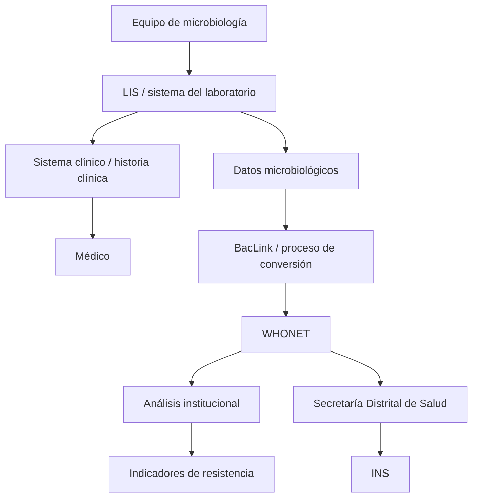
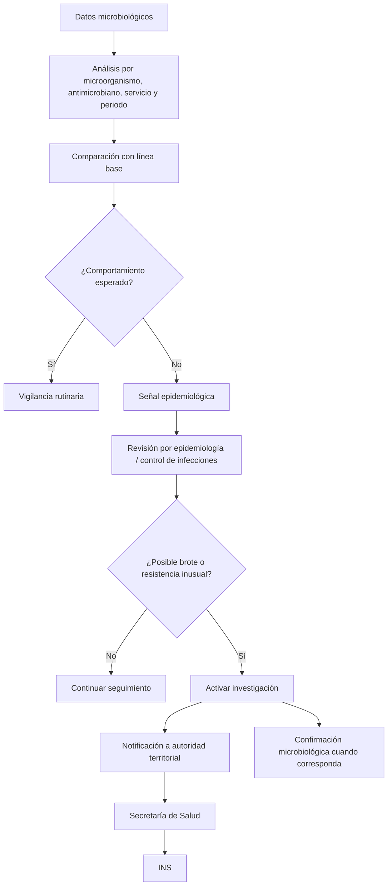
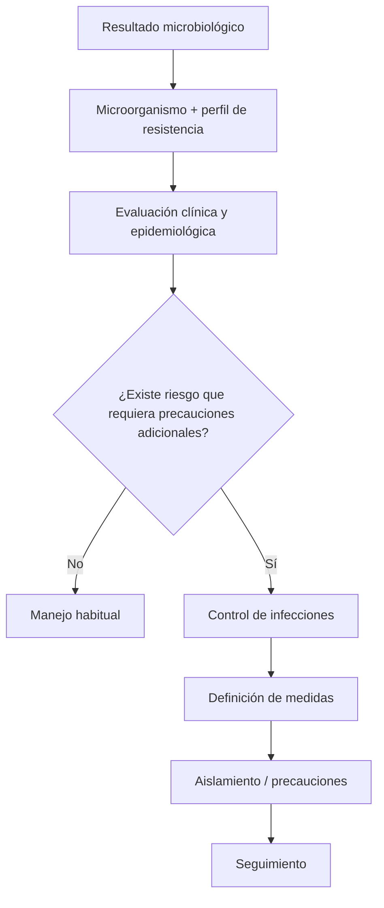
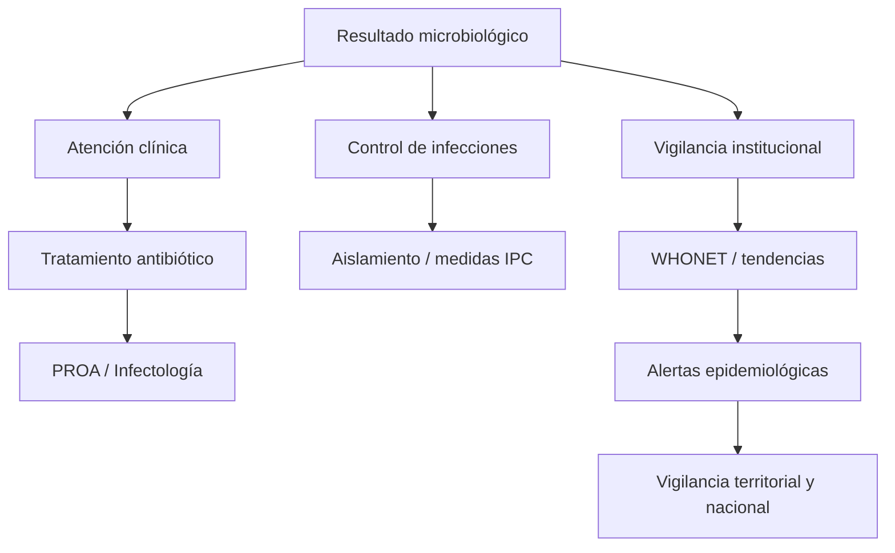
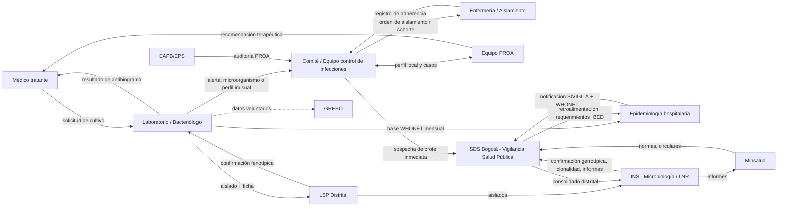
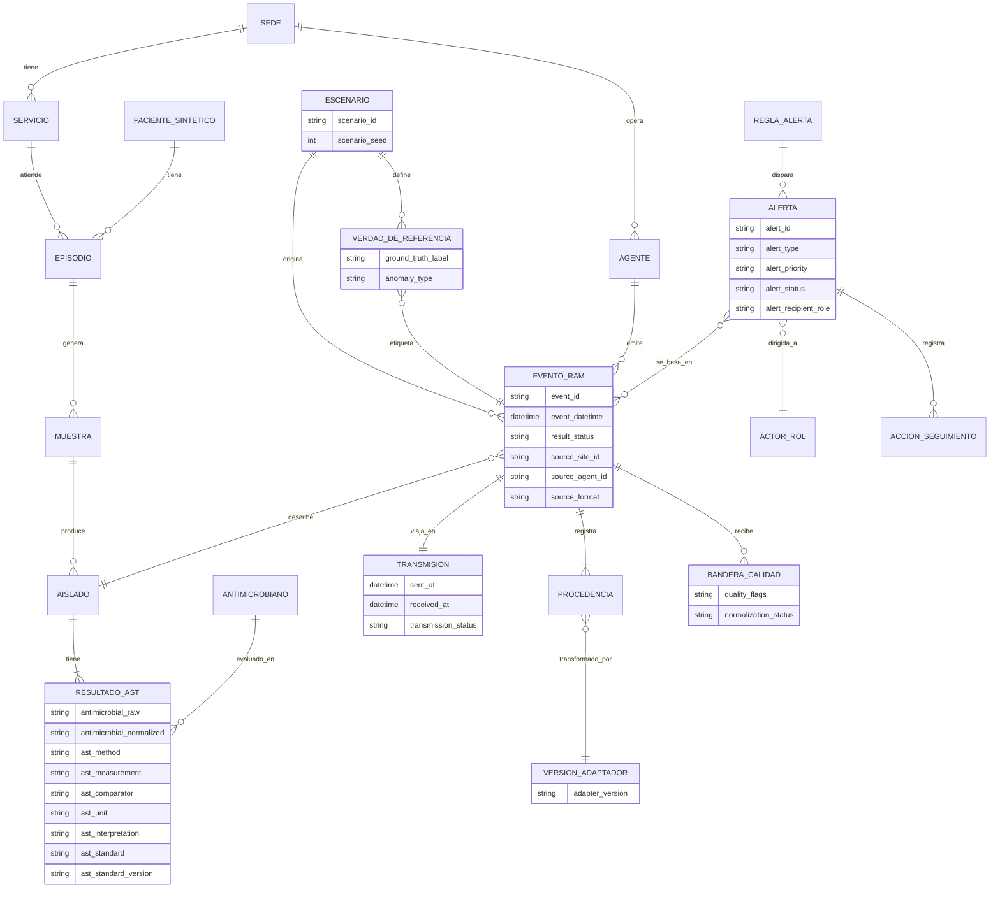

# Proyecto RAM — Documento unificado de investigación (Bloques A, B, C y D)

**Sistema de software con agentes simuladores de sedes hospitalarias para la generación de alertas sobre resistencia antimicrobiana (RAM) en un entorno simulado de Bogotá D.C.**

Equipo RAM — Pontificia Universidad Javeriana, Ingeniería de Sistemas
Versión de trabajo: 29 de septiembre de 2026 · Preparado para la reunión del 30 de septiembre de 2026

---

## 0. Cómo leer este documento

Este documento une en uno solo los cuatro entregables de la fase de investigación y responde, bloque por bloque, las preguntas asignadas:

| Bloque | Tema | Documento de origen |
|---|---|---|
| **A** | Flujo actual de la información | `flujo_completo_RAM_proyecto.md` (+ datos de D y B) |
| **B** | Documentos y datos que entran al sistema | `Investigacion_RAM_hospitalaria_Colombia(1).md` |
| **C** | Reglas y lógica de alertas | `bloque-c-reglas-y-logica-de-alertas_proyecto-final.md` |
| **D** | Alcance, actores y preparación de la reunión | `bloque_d_alcance_actores_reunion_husi_v2.md` |

El contenido que ya estaba bien se conservó. Solo se cambió lo necesario para que los cuatro bloques y el **Informe de avance de investigación y viabilidad técnica (24 de septiembre de 2026)** digan lo mismo.

### 0.1 Decisiones de unificación aplicadas

| # | Decisión | Efecto en este documento |
|---|---|---|
| 1 | **El informe del 24 de septiembre es la base que manda.** | Los bloques se alinean a él. Las excepciones son datos verificados después (p. ej., meropenem en lugar de "carbapenémicos"). |
| 2 | **HUSI es actor consultado, fuente opcional de validación y extensión opcional**; no es dependencia crítica. | Las preguntas del 30 de septiembre se formulan para validar y aprender, no para fijar requisitos. Se conserva el encabezado "qué necesita el cliente" solo como encuadre de la reunión. |
| 3 | **El S/I/R se conserva de origen**; el sistema no lo recalcula por defecto. | Se guardan valor crudo, categoría original y estándar. La reinterpretación es una regla opcional, versionada y marcada como "inferencia del sistema". |
| 4 | **Alertas de caso/aislado individual y pruebas de mecanismo pasan a fase 2**, junto con nuevo microorganismo, cambio de perfil y pseudobrote. | El núcleo son tres alertas: epidemiológica/agregada, calidad de datos y operacional. |
| 5 | **Baseline combinado:** el baseline sale del escenario simulado; la etiqueta de verdad sale de pruebas publicadas del Boletín Epidemiológico Distrital; el umbral es un parámetro. | Se evita la validación circular (ver C.6). |

### 0.2 Glosario para evitar ambigüedades

| Término | Significado en este documento |
|---|---|
| **Aislado (microbiano)** | Microorganismo recuperado de una muestra. Es lo que tiene antibiograma. El informe lo llama a veces "aislamiento". |
| **Aislamiento del paciente / precauciones** | Medida de control de infecciones (contacto, gotas, cohorte). Es lo que decide el comité o equipo de control de infecciones. |
| **Evento duplicado** | Registro repetido por fallo de transmisión o de captura. Genera alerta de **calidad** (R-CAL-02). |
| **Aislado repetido del paciente** | Mismo microorganismo del mismo paciente en días distintos. No es error: se conserva y se **deduplica solo dentro de cada análisis** (p. ej., primer aislado por paciente y periodo). |
| **Agregado** | Análisis que combina varias sedes simuladas. Equivale al nivel "Bogotá (SDS simulada)" de D. |
| **HUSI** | Hospital Universitario San Ignacio. |
| **Etiquetas de fuente (de B)** | **CO** = documentado por fuente colombiana · **INT** = referencia internacional · **H** = solo verificable con el hospital · **DISEÑO** = propuesta nuestra que requiere validación. |

> **Nota de terminología para el informe:** donde el informe dice "alerta de caso/aislamiento individual", se debe leer "alerta de caso/**aislado** individual" (ver ítem 6 del registro de correcciones, Anexo 1).

### 0.3 Alcance del sistema (resumen del informe)

- **Qué es:** un entorno experimental reproducible con agentes de software configurables que representan sedes hospitalarias hipotéticas. Cada agente genera y transmite eventos sintéticos de RAM a una plataforma central que valida, transforma a un modelo canónico, conserva la procedencia y produce alertas e indicadores verificables. El "agente hospitalario" no es inteligencia artificial ni un profesional virtual.
- **Diferenciador defendible:** el entorno experimental reproducible (múltiples sedes, heterogeneidad, fallos inyectados, procedencia extremo a extremo y evaluación contra verdad de referencia). **No** es "una plataforma que muestra resistencia y genera alertas": WHONET/BacLink y AMASS ya cubren buena parte de eso.
- **Núcleo mínimo (MVP):** dos agentes de sede con estructuras de entrada realmente diferentes · un modelo canónico pequeño pero completo · dos adaptadores de entrada con trazabilidad hasta el dato original · tres alertas (epidemiológica/agregada, calidad, operacional) · dashboard sencillo · arnés de pruebas con evaluador experimental.
- **Límites confirmados:** sin datos personales reales, sin conexión inicial a sistemas hospitalarios, sin diagnóstico, sin recomendación terapéutica, sin orden automática de aislamiento y sin pretender representar la epidemiología real de un hospital específico.

---

# BLOQUE A — Flujo actual de la información

> **Fuentes:** flujo de atención y vigilancia (Bloque A original), Bloque D (normas y actores) y Bloque B (documentos). Lo que solo HUSI puede confirmar se marca en A.6.

## A.1 Laboratorio → bacteriólogo → hospital

**Idea central:** un mismo resultado microbiológico alimenta varios procesos a la vez (atención clínica, control de infecciones, vigilancia institucional). Por eso no se representa como una sola línea.

1. **Sospecha de infección.** El paciente presenta signos locales (edema, eritema, supuración, dolor) o sistémicos (fiebre, taquicardia, hipotensión, deterioro). El médico evalúa y decide si se requiere muestra.
2. **Solicitud de muestra.** Depende del foco: hemocultivos (bacteriemia), cultivo de secreción (herida), urocultivo, muestra respiratoria u otra. Cuando la condición clínica lo permite, la muestra se toma antes de iniciar antibióticos; en pacientes graves puede iniciarse tratamiento empírico sin esperar el antibiograma.
3. **Cultivo.** La muestra llega al laboratorio de microbiología.
   - *Cultivo negativo:* normalmente no hay aislado ni antibiograma convencional. No descarta por sí solo la infección; el médico lo interpreta con clínica, antibiótico previo, calidad de la muestra y evolución.
   - *Cultivo positivo:* el bacteriólogo **identifica el microorganismo** (p. ej., *Klebsiella pneumoniae*) y realiza la prueba de susceptibilidad.
4. **Antibiograma.** Respuesta del aislado frente a antimicrobianos (interpretación S/I/R, más CIM/MIC o diámetro de halo, método, microorganismo, muestra, servicio, fecha y observaciones). Se interpreta con criterios estandarizados (CLSI o EUCAST). El laboratorio **valida** el resultado.
5. **Resultado al hospital.** El resultado validado queda en el sistema institucional (LIS/HIS/historia clínica) y llega al médico tratante.
   - Paciente sin antibiótico: el médico selecciona tratamiento dirigido.
   - Paciente con tratamiento empírico: se compara con la susceptibilidad y se mantiene, ajusta, cambia o desescala. Infectología o el PROA pueden apoyar.

> **Fuera del alcance del sistema:** la decisión clínica sobre el paciente. El sistema solo simula datos y señales.

**Qué generan los actores en este tramo**

| Actor | Función |
|---|---|
| Médico tratante | Evalúa, ordena estudios, interpreta y define tratamiento |
| Bacteriólogo / laboratorio | Procesa la muestra, identifica, realiza y valida la susceptibilidad |
| LIS / HIS | Conserva y distribuye la información |
| Infectología / PROA | Apoyan decisiones complejas y optimizan el uso de antimicrobianos |

## A.2 Hospital → vigilancia local, distrital y nacional

**Vía rutinaria (mensual, WHONET).** El laboratorio de cada UPGD (IPS que notifica, como HUSI) extrae los datos de su equipo automatizado o LIS, los convierte a WHONET con **BacLink** y los envía a la entidad territorial (SDS en Bogotá), que valida y consolida y los remite al INS.

- **Cobertura:** UCI y hospitalización, **no urgencias**; puntos de corte CLSI; nueve microorganismos priorizados: *S. aureus*, *S. epidermidis* (solo UCI neonatal y pediátrica), *E. faecalis*, *E. faecium*, *E. coli*, *K. pneumoniae*, *E. cloacae*, *P. aeruginosa* y *A. baumannii*.
- **Plazos:** la fuente primaria disponible (protocolo 2018) indica UPGD días 1–5, distrito, INS día 20. Un resumen secundario (ConsultorSalud, 25 sep 2026) habla de un protocolo 2026 con UPGD días 5–10 e INS hasta el día 30. **Los plazos 2026 no están verificados en el PDF original**; no se fijan como reglas.
- **Informe anual:** las entidades territoriales publican un análisis anual WHONET y lo envían al INS (segunda semana de mayo, según el lineamiento INS 2024).
- **Silencio epidemiológico:** ausencia de la base WHONET dentro de los plazos.
- **Depuración:** la base de vigilancia excluye negativos; por eso puede ser insuficiente para reconstruir todos los exámenes solicitados (B, S04).

**Vía inmediata (brotes y perfiles nuevos).** Se notifica de inmediato a la entidad territorial, aparte de la base mensual (ver A.3).

**Cómo se calcula la resistencia (vigilancia).**

$$\text{Resistencia (\%)} = \frac{\text{aislados resistentes}}{\text{aislados evaluados}} \times 100$$

Lectura correcta: aumenta la proporción de **aislados** resistentes a un antimicrobiano en una población y periodo. No significa que "los pacientes se vuelvan resistentes".

**Duplicados de un mismo paciente.** Para análisis de susceptibilidad se usan reglas de deduplicación (p. ej., primer aislado del paciente por periodo) para no inflar las proporciones. Se conservan todos los resultados en la base y se deduplica **en cada análisis** (CLSI M39; B §3.3).



**WHONET no es necesariamente el sistema clínico donde el médico consulta al paciente.** Los datos se convierten y analizan por separado. WHONET permite porcentajes de resistencia/susceptibilidad, perfiles, tendencias, análisis por microorganismo, antimicrobiano y servicio, e identificación de patrones inusuales.

## A.3 Qué pasa cuando aparece un caso importante

**Distinción clave**

| Situación | Ejemplo | ¿Alerta epidemiológica? |
|---|---|---|
| Resultado resistente individual | *K. pneumoniae* + meropenem R en un paciente | No necesariamente; puede requerir actuación clínica |
| Perfil de resistencia inusual | Microorganismo + perfil inesperado | Sí, tras revisión epidemiológica |
| Incremento de resistencia | 30 % → 31 % → 34 % → 42 % → 49 % | Sí: alerta de tendencia frente a la línea base |

**Flujo de una señal inusual o posible brote**



**Qué dicen las normas colombianas (fuentes públicas)**

- **Sospecha de brote de IAAS** (protocolo INS de brotes v02, 31 jul 2024): aumento de casos sobre lo esperado, **primer caso** de un microorganismo nuevo de interés en la IPS, o cambio del perfil de resistencia. Se sospecha **aunque sea un solo caso**. El primer SITREP se emite 24 horas después de la notificación. (El plazo de 24 h corresponde al SITREP de brotes; el protocolo de resistencia 2018 pide notificación inmediata sin plazo en horas.)
- **Circular 029 de 2021:** las IPS notifican de inmediato a la secretaría las sospechas de brote de IAAS y custodian los aislados; las secretarías monitorean cada mes con SIVIGILA y WHONET.
- **Comunicado INS sobre ceftazidima-avibactam:** el laboratorio reporta de inmediato al equipo de vigilancia y control de infecciones; se caracteriza como brote por perfil nuevo; se notifica a la entidad territorial y luego al INS. Documenta además que el resultado puede quedar suprimido en sistemas automatizados (B, S06).
- **Resolución 2471 de 2022 (anexo):** microbiología emite avisos sobre multirresistencia o patrones inusuales, con antibiogramas estratificados, reporte selectivo y alarmas en historia clínica con comunicación al PROA. Hallazgos sugeridos: bacteriemias, BLEE, AmpC, resistencia a meticilina, KPC, ciertos perfiles de *P. aeruginosa* y cultivos positivos de sitios estériles. No es una tabla universal de reglas informáticas (B, S01).
- **Confirmación por referencia:** los aislados viajan de la UPGD al Laboratorio de Salud Pública (LSP distrital) y de ahí al Grupo de Microbiología del INS, registrados en SIVILAB-LabMuestras (evento 313). Los brotes van a clonalidad.
- **Notificación oficial a SIVIGILA/SIVILAB/WHONET:** obligación legal de la UPGD y de la SDS; **el sistema no la reemplaza**.

## A.4 Qué pasa cuando se requiere aislamiento del paciente

Un cultivo positivo o una bacteria resistente **no** implican automáticamente aislamiento. La decisión depende del microorganismo, el perfil de resistencia, la vía de transmisión y el contexto clínico y epidemiológico.



- **Medidas posibles:** precauciones estándar, de contacto, por gotas, aéreas; cohorte; habitación individual; elementos de protección personal; higiene de manos reforzada.
- **Bogotá:** la Resolución SDS 3107 de 2023 obliga a las IPS de mediana y alta complejidad a implementar los lineamientos distritales de carbapenemasas (tamizaje, aislamiento, cohortización, notificación de bases). El lineamiento indica aislamiento preventivo durante toda la hospitalización como mínimo y **no define criterios para levantarlo**. Ante una carbapenemasa se informa de inmediato al servicio tratante y al equipo de control de infecciones.
- **Quién decide:** el comité o equipo de control de infecciones (IAAS). Enfermería aplica las precauciones y el tamizaje. El médico y el PROA no deciden el aislamiento.
- **En el sistema:** el aislamiento del paciente **no** es una decisión del sistema. Como máximo se simula el **evento** "orden emitida" para probar trazabilidad; no se emite ninguna orden.

## A.5 Las tres rutas desde un mismo resultado



| Ruta | Pregunta que responde |
|---|---|
| Clínica | ¿Qué tratamiento necesita este paciente? |
| Control de infecciones | ¿Se requieren medidas para evitar transmisión dentro del hospital? |
| Vigilancia RAM | ¿Cómo se comporta la resistencia y está ocurriendo algo fuera de lo esperado? |

**La arquitectura conceptual del proyecto** está en el punto donde distintos hospitales producen información microbiológica con formatos y sistemas distintos y esos datos deben convertirse en eventos comparables, con procedencia, para generar indicadores y alertas.

**Cinco preguntas que guían el estudio del flujo real:** ¿cómo nace el dato? · ¿qué datos se generan? · ¿quién los recibe y utiliza? · ¿cómo pasan de un sistema o actor a otro? · ¿qué condición convierte un resultado rutinario en una alerta?

## A.6 Qué partes solo puede confirmar HUSI

Lo que ya se sabe por fuentes públicas se toma como **punto de partida**, no como descripción del hospital. Lo que solo HUSI puede confirmar queda como pregunta (ver banco de preguntas, D.6).

| # | Aspecto | Qué se sabe por fuentes públicas | Solo lo confirma HUSI |
|---|---|---|---|
| 1 | Sistema del laboratorio | Un documento histórico de HUSI menciona LabPro/WHONET y antibiograma automatizado por CIM (portafolio 2019, B S07) | Infraestructura, versión y flujo de septiembre 2026 |
| 2 | Sistema con que el médico consulta | — | Sí |
| 3 | Integración laboratorio ↔ historia clínica | — | Sí |
| 4 | Resultados preliminares y definitivos | El modelo debe soportar estados (B §5) | Estados reales del LIS |
| 5 | Quién valida el resultado | Rol del bacteriólogo (CO/INT) | Cargo y firma |
| 6 | Qué resultados generan notificación inmediata | Hallazgos sugeridos en Res. 2471 y comunicado CZA | Lista real |
| 7 | Cómo recibe el médico la notificación | — | Sí |
| 8–9 | Quién activa aislamiento y con qué reglas | Comité IAAS decide; lineamiento SDS de carbapenemasas | Reglas internas y criterio de levantamiento |
| 10–12 | Cuándo intervienen infectología, PROA y control de infecciones | Roles definidos en Res. 2471 | Disparadores reales |
| 13–14 | Extracción de datos para WHONET y quién convierte con BacLink | Proceso general (INS); UPGD envía mensualmente | Responsable, frecuencia, errores frecuentes |
| 15 | WHONET solo externo o también interno | — | Sí |
| 16 | Cómo se identifica una resistencia inusual | Definiciones INS de sospecha de brote | Práctica interna |
| 17 | Cómo se investiga un posible brote | Protocolo INS de brotes | Práctica interna |
| 18 | Quién notifica a la SDS | La UPGD responde legalmente; epidemiología hospitalaria notifica | Nombre del cargo y quién firma |
| 19 | Qué documentos o archivos se envían | Base WHONET, ficha de remisión, SITREP, SIVIGILA | Formatos reales |
| 20 | Seguimiento al cierre de una alerta | — | Sí |

---

# BLOQUE B — Documentos y datos que entran al sistema

> **Alcance de la evidencia (de la investigación técnica, consulta del 27 sep 2026):** es una **revisión documental técnica**, no una revisión sistemática. No se obtuvo un informe clínico actual de HUSI, ni una exportación de su laboratorio, ni su diccionario de datos. El documento de la SDS `Lineam_RAM_2026.pdf` devolvió HTTP 403 y no se atribuyen requisitos a su contenido; el protocolo INS de resistencia bacteriana 2022 devolvió 404 y la copia hallada corresponde a 2018.
>
> **Este bloque describe el sistema real y las referencias.** Los campos que entran al modelo sintético están en B.5. **El prototipo no usa datos personales reales.**

## B.1 Formato del antibiograma

### B.1.1 Antibiograma individual

Es el resultado de susceptibilidad de **un aislado**, no una propiedad permanente del paciente ni de toda la especie. Un cultivo puede contener varios aislados y cada uno requiere sus resultados. WHONET documenta registros por aislado y exportaciones con una fila por antibiótico (S14, S16).

**Tres ejemplos verificables**

| # | Ejemplo | Qué muestra | Advertencia |
|---|---|---|---|
| A | **Colombia: ficha oficial INS, versión 08** (anexo 1 del documento de **marzo de 2026**, página 26 del PDF, impresa 25) | Bloques de paciente, aislado, confirmación y susceptibilidad (método, antibiótico, resultado con unidades, interpretación) | Es una **ficha de remisión**, no una plantilla nacional única del informe clínico |
| B | **Informe de ejemplo de ARUP Laboratories (código 2008476)** | Paciente, episodio, médico, muestra, cultivo, organismo, susceptibilidad por antibiótico, fechas de verificación. *E. coli*: ciprofloxacina CIM ≥4 µg/mL resistente; meropenem CIM ≤0,5 µg/mL susceptible | Identificadores ficticios; valores de ese ejemplo, no puntos de corte |
| C | **Informe clínico imprimible de WHONET** (tutorial oficial, 2006) | Institución, paciente, ubicación, muestra, organismo, antibióticos, categoría y diámetro en mm | Demostración de formato; sus reglas no deben usarse como criterios de 2026 |

Enlaces para inspeccionar los originales:

- [Ficha INS 2026, anexo 1](https://www.ins.gov.co/BibliotecaDigital/criterios-para-envio-de-aislamientos-bacterianos-y-levaduras-del-genero-candida-y-generos-relacionados-recuperados-en-iaas-para-confirmacion-de-mecanismos-de-ra-2026.pdf#page=26)
- [Informe publicado por ARUP](https://ltd.aruplab.com/api/ltd/examplereport?report=2008476%2C%20Positive.pdf)
- [Imagen del informe demostrativo WHONET](https://whonet.org/WebDocs/WHONET%203.Data%20entry_files/image010.jpg)

### B.1.2 Cómo interpretar sus campos

| Elemento | Significado técnico | Consecuencia para el software |
|---|---|---|
| Microorganismo | Género/especie identificada | La interpretación depende del organismo |
| Antimicrobiano | Sustancia o combinación evaluada | Conservar código y nombre; no confundir componentes |
| CIM o MIC | Concentración mínima que inhibe el crecimiento bajo el método usado | Guardar valor, comparador y unidades |
| Diámetro del halo | Medición de difusión en disco, en mm | No mezclar con CIM |
| Categoría interpretativa | Resultado categórico bajo un estándar | **Conservar la categoría original** |
| Método | Procedimiento con que se obtuvo la medición | Permite evaluar comparabilidad y procedencia |
| Norma y versión | Reglas y puntos de corte aplicados | Evita reinterpretaciones históricas silenciosas |
| Comentario | Aclaración del laboratorio | No sustituirlo por una inferencia automática |

> **S/I/R no significa lo mismo bajo todos los estándares.** EUCAST define I como "susceptible con mayor exposición" y desaconseja agrupar I y R como resistencia; CLSI conserva consideraciones propias para I y categorías como SDD. **El sistema debe admitir la categoría emitida por el laboratorio sin forzarla a un booleano sensible/resistente.**

**Estándar vigente.** CLSI M100, edición 36, se publicó el 26 de enero de 2026 (la página del estándar indica correcciones de julio de 2026). Antes de programar umbrales hay que confirmar la edición realmente implementada por el hospital. En el proyecto la versión del estándar es un **parámetro configurable**; la pregunta de si HUSI usa EUCAST en algún caso queda abierta.

**Quién lo genera y quién lo recibe.** El profesional de microbiología identifica el organismo y su perfil; el instrumento mide y el proceso de revisión y autorización lo libera. Recibe el equipo tratante; ciertos hallazgos alimentan PROA y control de infecciones. No hay evidencia pública para fijar canal, firma, cargo validador o tiempo de entrega en HUSI.

### B.1.3 Antibiograma acumulado

Tabla poblacional: organismo, número de aislados y proporciones de susceptibilidad por antimicrobiano, con periodo y población definidos. CLSI M39 orienta su construcción para apoyar la terapia empírica y advierte que seleccionar solo el primer aislado por paciente/especie/periodo puede ocultar resistencia emergente para otros análisis.

**Decisión de diseño:** conservar todos los resultados originales y aplicar deduplicación en cada análisis; registrar el denominador efectivo por combinación organismo-antimicrobiano y documentar exclusiones.

## B.2 Informe del bacteriólogo (informe de microbiología)

- **Puede existir informe sin antibiograma:** cultivo sin crecimiento, flora/crecimiento mixto, organismo sin estudio de susceptibilidad, identificación molecular o resultado preliminar. El **reporte selectivo** significa que algunos antibióticos estudiados no se muestran; no es lo mismo que no haberlos estudiado (CDC).
- **Contenido según la OMS (referencia internacional):** identificación del laboratorio y del paciente, solicitante, muestra, fecha de toma, pruebas y resultados, comentarios pertinentes, responsable autorizado y fecha/hora de liberación; comunicación de resultados críticos y conservación de informes revisados. **No hay un formulario colombiano único** que obligue a una diagramación idéntica.
- **Según el tipo de muestra** pueden agregarse Gram, cuantificación del crecimiento y pruebas adicionales (guía IDSA/ASM 2024). No se deben exigir idénticos campos analíticos a un urocultivo y a un hemocultivo.
- **Estados que debe soportar el modelo (DISEÑO):** recibido, en proceso, preliminar, final, corregido, anulado y rechazado, mapeados a los estados reales del LIS. Alertar con base en preliminares debe ser una política explícita.
- **Cuatro niveles que no se mezclan:**
  1. *Resultado observado* (medición o detección).
  2. *Interpretación del laboratorio* (categoría o comentario liberado).
  3. *Inferencia del sistema* (regla aplicada con su versión).
  4. *Confirmación de referencia* (resultado posterior del LSP/INS).
- Una sospecha fenotípica y la detección de un gen no deben ocupar un único campo booleano llamado "resistencia confirmada".

## B.3 Guía PROA

- **Marco nacional identificado:** Resolución 2471 del 9 de diciembre de 2022 y su anexo técnico (IAAS y PROA). No se encontró una norma posterior que la sustituya; la Resolución 914 de 2025 todavía la cita.
- **Anexo de 2471:** asigna a microbiología informes individuales y agregados, perfiles de susceptibilidad, avisos de multirresistencia o patrones inusuales, antibiogramas estratificados, reporte selectivo y alarmas en historia clínica con comunicación al PROA.
- **Documento técnico PROA de Minsalud/ACIN:** fechado **julio de 2019** (no es una guía nueva de 2025). Incluye formato de prescripción/preautorización y ajustes según contexto clínico, peso, función renal y CIM; contempla DDD y DOT.
- **DDD y DOT:** DDD es una unidad agregada de consumo, no la dosis real prescrita. DOT cuenta días de terapia por agente y requiere definición operacional.

**Qué necesita el PROA y qué producto de software se propondría** (DISEÑO; describe una posible extensión, no pantallas existentes en HUSI):

| Necesidad del PROA | Entradas que deben vincularse | Producto propuesto |
|---|---|---|
| Revisar un resultado resistente relevante | Resultado validado, especie, muestra, paciente, tratamiento activo | Caso para revisión por PROA |
| Revisar pertinencia del antimicrobiano | Indicación, diagnóstico, tratamiento, microbiología, guía local | Lista de revisión con evidencia |
| Evaluar oportunidad del estudio | Hora de toma y primera administración | Indicador temporal |
| Evaluar el cambio terapéutico | Resultado, recomendación, decisión médica | Trazabilidad de aceptación/rechazo |
| Describir comportamiento institucional | Aislados, población, periodo, criterios | Perfil estratificado reproducible |
| Medir consumo | Cantidad consumida o días de administración, servicio, denominador | Indicadores de consumo separados de resistencia |

> **Fuera del núcleo del proyecto:** prescripción, administración y consumo (filas de clínica y PROA de B.4). Son función del PROA y del médico tratante; se documentan como contexto y posible extensión futura.

## B.4 Qué campos aparecen en esos documentos

**Cómo leerla:** RM = reporte microbiológico · AI = antibiograma individual · FI = ficha INS · W = registro/exportación WHONET · HC = historia clínica · RX = prescripción/preautorización · ADM = administración · AA = antibiograma acumulado. L = laboratorio · T = tratante · P = PROA · E = epidemiología/control de infecciones · R = LSP/INS.

La columna "Fuente" acredita la existencia o el fundamento del dato. **Los usos son propuestas analíticas; el productor es el origen funcional habitual y debe confirmarse localmente.** Que un dato esté en una ficha no implica que esté en el PDF clínico. **No todos son obligatorios para todo resultado**; "no aplica", "no realizado", "pendiente", "no disponible" y "negativo" deben conservar significados distintos.

La última columna (**Modelo**) es propuesta del equipo: **N** = núcleo del prototipo sintético · **E** = extensión / fase 2 · **X** = fuera del modelo · **v0.2** = campo que hay que agregar al diccionario.

### B.4.1 Identidad, atención y muestra

| N.º | Dato | Qué significa | Documento | Genera → Usa | Fuente | Modelo |
|---|---|---|---|---|---|---|
| 1 | Identificador del paciente | Enlace estable de resultados | W, RM | Admisiones → L/T/P/E | S04, CO | N (sintético) |
| 2 | Nombre | Identificación humana asistencial | FI, RM | Admisiones → L/T | S03, CO | X |
| 3 | Tipo y número de documento | Identidad administrativa | FI | Admisiones/UPGD → L/R | S03, CO | X |
| 4 | Fecha de nacimiento/edad | Contexto demográfico; incluir unidad | W | Admisiones → P/E | S04, CO | N (opcional) |
| 5 | Sexo registrado | Variable demográfica | W | Admisiones → E | S04, CO | N (opcional) |
| 6 | IPS y laboratorio procesador | Diferencia remitente de ejecutor | FI | UPGD → L/R | S03, CO | N |
| 7 | Departamento/municipio | Localización institucional del envío | FI | UPGD → R | S03, CO | X |
| 8 | Servicio y tipo de localización | UCI, hospitalización u otra categoría | W | Atención; L incorpora → P/E | S04, CO | N |
| 9 | Identificador del episodio | Distingue ingresos de una persona | RM/HC | Admisiones → T/P/E | S12, INT; H | N (recomendado) |
| 10 | Fecha de ingreso | Contextualiza la muestra en la estancia | W/HC | Admisiones → E | S17, INT; H | N (opcional) |
| 11 | Número de muestra | Identifica el material recibido | W/RM | L → L/T/E | S17, INT; H | N |
| 12 | Fecha/hora de toma | Momento de recolección | RM | Recolector → L/P/E | S12, INT; S04, CO | N |
| 13 | Tipo de muestra | Sangre, orina, tejido, etc. | W/RM | Solicitante/recolector → L/P/E | S04, CO | N |
| 14 | Sitio anatómico | Precisión adicional al material | RM | Solicitante/recolector → L/T | S13, INT; H | E |
| 15 | Técnica/origen de obtención | Diferencia métodos de recolección | FI/solicitud | Recolector → L/R | S03, CO | X |
| 16 | Recepción de muestra | Momento de llegada al laboratorio | RM/LIS | L → L/calidad | S13, INT; H | E |
| 17 | Calidad o rechazo | Limitación preanalítica y motivo | RM/recepción | L → L/T | S15, INT; H | E |
| 18 | Finalidad clínica o tamizaje | Diferencia diagnóstico de búsqueda de colonización | Solicitud/W | Solicitante/E → E/P | S25, INT; H | E |

### B.4.2 Microbiología y susceptibilidad

| N.º | Dato | Qué significa | Documento | Genera → Usa | Fuente | Modelo |
|---|---|---|---|---|---|---|
| 19 | Resultado del cultivo | Crecimiento o conclusión microbiológica | RM | L → T/P/E | S12, S22, INT; H | E (el núcleo modela aislados) |
| 20 | Tinción/Gram | Hallazgo microscópico, si aplica | RM | L → T/L | S24, INT; H | X |
| 21 | Recuento/crecimiento | Cuantificación y unidad | RM | L → T/L | S24, INT; H | X |
| 22 | Género/especie | Identidad del microorganismo | FI/W/AI | L → T/P/E/R | S03, S04, CO | N |
| 23 | Identificador del aislado | Separa organismos de una muestra | LIS/modelo | L/integración → todos | S16; DISEÑO/H | N |
| 24 | Método de identificación | Técnica usada | RM | L → L/R | S13, INT; H | E |
| 25 | Antimicrobiano | Agente estudiado | AI/W | L → T/P/E | S16, INT; S03, CO | N |
| 26 | Método de susceptibilidad | Difusión, dilución u otro | AI/exportación | L → L/P | S16, INT | N |
| 27 | Valor de CIM | Medición de concentración | AI/W | L/equipo → L/T/P/E | S16, INT | N |
| 28 | Comparador de CIM | ≤, ≥, <, > o igualdad | AI/exportación | L/equipo → L/integración | S16, INT | v0.2 |
| 29 | Unidad de CIM | Unidad de concentración | AI | L/equipo → L/integración | S16, INT | N |
| 30 | Diámetro del halo | Medición en mm | AI/W | L → L/P/E | S14, INT | N |
| 31 | Interpretación liberada | S, I, R, SDD u otra categoría | AI | L → T/P/E | S20–S21, INT | N |
| 32 | Estándar/edición | Referencia interpretativa aplicada | Configuración/LIS | L → L/integración | S18; DISEÑO/H | v0.2 |
| 33 | Estado probado/no probado/suprimido | Explica ausencia de un resultado visible | Equipo/LIS | L → P/E/integración | S22, INT; S06, CO | E |
| 34 | Comentario interpretativo | Aclaración emitida por laboratorio | AI/RM | L → T/P | S22, INT | X |
| 35 | Mecanismo por confirmar | Motivo de estudio de referencia | FI | UPGD → R/E | S03, CO | E (fase 2) |
| 36 | Prueba confirmatoria y resultado | Evidencia adicional según prueba | FI/RM | UPGD/LSP/INS → L/R/P/E | S03, CO | E (fase 2) |
| 37 | Genes/blancos evaluados | Alcance de la prueba molecular | FI/RM molecular | L/R → L/P/E | S03, CO | E (fase 2) |
| 38 | Fecha/hora de liberación | Disponibilidad del resultado autorizado | RM | L/LIS → T/P/E | S15, INT; H | N (`event_datetime`) |
| 39 | Revisor/autorizador | Responsable de validar el informe | RM | L → calidad/T | S15, INT; H | X |
| 40 | Estado y versión del resultado | Distingue final, preliminar y correcciones | LIS/RM | L → todos | S15; DISEÑO/H | v0.2 |

### B.4.3 Clínica, PROA, vigilancia y control de calidad

| N.º | Dato | Qué significa | Documento | Genera → Usa | Fuente | Modelo |
|---|---|---|---|---|---|---|
| 41 | Diagnóstico y grado de certeza | Motivo infeccioso sospechado/confirmado | RX/HC | T → P/farmacia | S02, CO | X |
| 42 | Indicación terapéutica/profilaxis | Finalidad del medicamento | RX | T → P/farmacia | S02, CO | X |
| 43 | Fármaco, dosis, frecuencia y duración | Régimen solicitado/actual | RX | T → P/farmacia | S02, CO | X |
| 44 | Razón del cambio | Justificación de ajuste o adición | RX | T → P | S02, CO | X |
| 45 | Peso y función renal | Contexto de evaluación posológica | HC/laboratorio | Equipo asistencial → T/P/farmacia | S02, CO | X |
| 46 | Prescriptor y visto bueno PROA | Responsables y fecha de autorización | RX | T/P → farmacia/auditoría | S02, CO | X |
| 47 | Administración efectiva | Agente, fecha y dosis realmente administrada | ADM | Enfermería → P/farmacia | S23; INT/H | X |
| 48 | Gramos consumidos | Numerador del consumo agregado | Registro de consumo | Farmacia → P/E | S10, CO | X |
| 49 | Camas/días-cama y servicio | Denominador y estrato de consumo | Censo hospitalario | Gestión hospitalaria → P/E | S10, CO | X |
| 50 | Clasificación de IAAS | Asociación a dispositivo/sitio | W/vigilancia | E; L incorpora → E/R | S04, CO | X |
| 51 | Origen de infección | Comunitario/hospitalario | Vigilancia/HC | E → E | S26, INT; H | X |
| 52 | Sospecha de brote | Señal para investigación | FI | UPGD/E → R/E | S03, CO | E (fase 2, como escenario) |
| 53 | Evolución del paciente | Desenlace consignado | FI/HC | Atención; UPGD incorpora → E/R | S03, CO | X |
| 54 | Orden de remisión y resultado de referencia | Seguimiento externo del aislado | FI/SIVILAB | UPGD/LSP/INS → L/R/E | S03, CO | X |
| 55 | Periodo, estrato y población | Alcance del resumen estadístico | AA | Analista → P/T | S19, INT | N (configuración del baseline) |
| 56 | Número analizado y porcentajes | Denominadores/resultados por combinación | AA | Analista → P/E/T | S19, INT | N (derivado) |
| 57 | Versión de deduplicación y exclusiones | Define qué registros participan | Configuración analítica | Analista → P/E/calidad | S19; DISEÑO | v0.2 |
| 58 | Resultado de control de calidad | Evidencia técnica; separada de pacientes | Registros de calidad | L → L/calidad | S27, INT | E |
| 59 | Comunicación crítica y receptor | Traza la entrega de un hallazgo | Registro de aviso | L → T/E/calidad | S15, INT | E |
| 60 | Regla, evidencia y seguimiento de alerta | Explica qué se activó y su resolución | Sistema propuesto | Motor y responsables → P/E/L | DISEÑO; H | N |

## B.5 Qué información de esos documentos sirve a nuestro sistema

### B.5.1 Núcleo mínimo para alertas microbiológicas (DISEÑO)

1. Identificador de hospital/laboratorio (sede simulada) y del paciente sintético.
2. Identificador de muestra y de aislado.
3. Tipo de muestra, fecha/hora de toma y ubicación disponible.
4. Microorganismo, código de origen y normalización.
5. Antimicrobiano, método y resultado interpretado (categoría original).
6. Medición original, unidad y comparador cuando existan.
7. Estado del resultado y fecha/hora de validación o disponibilidad.
8. Fuente, identificador externo y versión de cada resultado.
9. Catálogo de reglas, responsables y prioridad.
10. *(Fase 2)* Pruebas confirmatorias y su estado.

**Reglas de integridad:** para una regla que use la categoría validada puede admitirse una entrada sin CIM, señalando la limitación. **Sin medición, método o estándar suficiente no se recalcula una categoría.** Si falta el enlace seguro con el paciente, el registro pasa a una cola de conciliación, no a un aviso dirigido.

### B.5.2 Diccionario de datos v0.2 (propuesta)

Parte del diccionario v0.1 del informe (mismos nombres) y agrega los campos que los bloques necesitaban y el diccionario no tenía. **Los campos v0.2 están pendientes de aprobación del equipo.**

| Variable | Grupo | Descripción / uso | Req. | Origen |
|---|---|---|---|---|
| `source_site_id` | Origen | Sede simulada que origina el evento | Obligatoria | v0.1 |
| `source_agent_id` | Origen | Instancia del agente emisor | Obligatoria | v0.1 |
| `source_format` | Origen | Formato/vocabulario de entrada de la sede | Obligatoria | v0.1 |
| `event_id` | Trazabilidad | Identificador único del evento sintético | Obligatoria | v0.1 |
| `event_datetime` | Trazabilidad | Momento en que ocurre el evento en el escenario (liberación del resultado) | Obligatoria | **v0.2** |
| `synthetic_patient_id` | Caso | Identificador artificial del paciente | Obligatoria | v0.1 |
| `synthetic_episode_id` | Caso | Agrupa eventos de un mismo episodio | Recomendada | v0.1 |
| `sex`, `age_or_age_group` | Caso | Demografía sintética | Opcional | v0.1 |
| `patient_location` | Contexto | Servicio genérico (UCI, hospitalización, urgencias…) | Recomendada | v0.1 |
| `admission_date` | Contexto | Fecha de ingreso sintética | Opcional | v0.1 |
| `specimen_id` | Muestra | Identificador artificial de muestra | Obligatoria | v0.1 |
| `specimen_collection_datetime` | Muestra | Fecha/hora de toma | Obligatoria | v0.1 |
| `specimen_type_raw` / `specimen_type_normalized` | Muestra | Tipo de muestra original / armonizado | Obligatoria | v0.1 |
| `isolate_id` | Aislado | Identificador artificial del aislado | Obligatoria | v0.1 |
| `organism_raw` / `organism_normalized` | Aislado | Microorganismo original / armonizado | Obligatoria | v0.1 |
| `antimicrobial_raw` / `antimicrobial_normalized` | AST | Antimicrobiano original / armonizado | Obligatoria | v0.1 |
| `ast_method` | AST | Método de prueba | Recomendada | v0.1 |
| `ast_measurement` | AST | Valor cuantitativo (diámetro o MIC) | Recomendada | v0.1 |
| `ast_comparator` | AST | ≤, ≥, <, > o igualdad de la CIM | Condicional | **v0.2** |
| `ast_unit` | AST | Unidad del valor cuantitativo | Condicional | v0.1 |
| `ast_interpretation` | AST | **Categoría original reportada por la fuente** (S/I/R/SDD u otra) | Obligatoria para escenarios de resistencia | v0.1 |
| `ast_standard` / `ast_standard_version` | AST | Estándar (CLSI/EUCAST) y edición aplicada por la fuente | Obligatoria | **v0.2** |
| `inferred_interpretation` | AST | Categoría recalculada por el sistema, **solo si** una regla lo activa; nunca sustituye a `ast_interpretation` | Condicional | **v0.2** |
| `result_status` / `result_version` | Resultado | Preliminar, final, corregido, anulado, rechazado / versión | Obligatoria | **v0.2** |
| `sent_at` / `received_at` | Transmisión | Emisión / recepción en la plataforma | Obligatoria | v0.1 |
| `transmission_status` | Transmisión | Estado del envío (enviado, retrasado, perdido, duplicado) | Obligatoria | **v0.2** |
| `normalization_status` | Calidad | Resultado de validación/mapeo | Obligatoria | v0.1 |
| `quality_flags` | Calidad | Faltantes, inválidos, inconsistencias, duplicados | Recomendada | v0.1 |
| `adapter_version` | Procedencia | Versión del adaptador que transformó el evento | Obligatoria | v0.1 |
| `scenario_id` | Experimento | Escenario reproducible que originó el evento | Obligatoria en pruebas | v0.1 |
| `scenario_seed` | Experimento | Semilla de ejecución | Obligatoria en pruebas | **v0.2** |
| `anomaly_type` | Experimento | Tipo de anomalía inyectada | Condicional | v0.1 |
| `ground_truth_label` | Experimento | Verdad de referencia; solo la usa el evaluador | Obligatoria en pruebas | v0.1 |
| `dedup_policy_version` | Análisis | Política de deduplicación y exclusiones aplicada a un análisis | Condicional | **v0.2** |
| `alert_id`, `alert_type`, `alert_priority`, `alert_status` | Alerta | Identificador, clase, prioridad interna y estado (Nueva, En revisión, Confirmada, Cerrada) | Condicional | `alert_type` y `alert_priority` v0.1; el resto **v0.2** |
| `alert_rule_id` / `alert_rule_version` | Alerta | Regla que la activó y su versión | Condicional | **v0.2** |
| `alert_recipient_role` | Alerta | Rol destinatario (no una persona) | Condicional | **v0.2** |

> **Nota WHONET:** se recomienda conservar, cuando sea posible, tanto la medición cuantitativa del AST como su interpretación; si solo puede preservarse una, la medición contiene más información para reinterpretación posterior.

**Calidad, denominadores y evaluación (controles propuestos)**

- Validar unidades y comparadores: `≤0,5` no equivale a `0,5` exacto ni a dato ausente.
- Distinguir muestras clínicas, tamizajes, ambientales y de control de calidad.
- Conciliar nombres locales de microorganismos, servicios y fármacos.
- No asumir que "sin resultado" significa susceptible ni que "gen no detectado" descarta todos los mecanismos.
- Retener negativos en el repositorio de origen si se quiere calcular positividad; una exportación de vigilancia puede excluirlos.
- No deducir infección, colonización o contaminación solo del crecimiento.
- Separar cambio de resistencia de cambio en panel, punto de corte o población muestreada.

### B.5.3 Entidades y arquitectura de datos

El modelo de B propone `Paciente, Episodio, UbicacionTemporal, Solicitud, Muestra, Aislado, ResultadoAST, PruebaMecanismo, VersionInforme, Prescripcion, Administracion, Regla, Alerta, GestionAlerta`. Para el prototipo:

- **Entran:** Paciente (sintético), Episodio, Muestra, Aislado, ResultadoAST, Regla, Alerta y las entidades de simulación de D.3 (Sede, Agente, Escenario, Transmisión, Procedencia, VerdadDeReferencia).
- **Fase 2 / extensión:** PruebaMecanismo, VersionInforme completa, GestionAlerta.
- **Fuera:** Prescripcion y Administracion (función del PROA y del médico tratante).

Relaciones fundamentales: un paciente tiene múltiples episodios y muestras; una muestra tiene cero, uno o varios aislados; un aislado tiene múltiples pruebas (incluso para el mismo antimicrobiano con distintos métodos o fechas); un informe puede corregirse y la alerta mantiene vínculo con la versión que la originó. Una tabla plana de una fila por paciente perdería información; el modelo relacional puede exportar después una vista compatible con WHONET (BacLink admite organización por aislado o por resultado de antibiótico).

**Contrato de integración propuesto:** código original, valor original, código normalizado, unidad, comparador, método, estado, identificadores de relación y marcas temporales. HL7 v2, FHIR o CSV son opciones a negociar. La importación debe ser idempotente y registrar correcciones sin duplicar alertas.

**Datos reales y desidentificados.** Todo el prototipo trabaja con **datos sintéticos**. Si en el futuro HUSI autoriza datos históricos anonimizados, solo servirían para validar el adaptador de entrada, bajo autorización explícita y sin alterar el carácter sintético del resto (ver pregunta E7).

## B.6 Qué formatos reales usa HUSI (pendiente para la reunión)

Lo verificado es solo evidencia **histórica**: un documento de procedimientos del laboratorio clínico de HUSI que describe antibiograma automatizado, referencia a CLSI y uso de LabPro/WHONET, y un portafolio 2019 con antibiograma por CIM automatizada. **Eso no confirma su infraestructura, versión, plantilla ni flujo de septiembre de 2026.**

Se necesita de HUSI (preguntas C1–C4 y E6 del banco D.6):

1. Informes actuales desidentificados de hemocultivo, urocultivo y tamizaje, incluyendo un preliminar, un final, una corrección y una prueba de mecanismo.
2. Equipo, LIS y versiones de CLSI/EUCAST; qué se exporta a WHONET, con qué frecuencia y qué queda suprimido o completado manualmente.
3. Cómo se relacionan paciente, ingreso, muestra y cada aislado; si la ubicación corresponde a la toma o a la ubicación actual.

**Antecedentes científicos útiles (sin extrapolar a HUSI hoy):** un estudio en *Infectio* (2017), con autoras afiliadas a HUSI, evaluó SaTScan-WHONET con datos históricos; el análisis prospectivo simulado no superó a la vigilancia activa en oportunidad de detección. Un estudio en *Biomédica* (2023) analizó veinte instituciones de doce ciudades entre 2018 y 2021 y muestra uso real de datos microbiológicos para vigilancia.

---

# BLOQUE C — Reglas y lógica de alertas

> **Principio rector:** *"El sistema no decide clínicamente; detecta y documenta señales configuradas sobre datos sintéticos para apoyar ejercicios de vigilancia."* No diagnostica, no recomienda tratamientos y no representa la epidemiología real de hospitales de Bogotá.

## C.1 Qué situaciones deben disparar alerta

**Núcleo (tres clases confirmadas en el informe):**

| Clase | Qué detecta | Ejemplos | Qué **no** significa |
|---|---|---|---|
| **Epidemiológica / agregada** | Cambios relevantes en la resistencia respecto a la línea base | Aumento de una combinación microorganismo-antimicrobiano por sede/servicio/periodo; incremento controlado de un fenotipo de vigilancia; el mismo patrón en varias sedes en el mismo periodo | Que exista un brote confirmado |
| **Calidad de datos** | Problemas en la información | Campo obligatorio faltante, valor inválido, microorganismo o antimicrobiano no reconocido, evento duplicado, S/I/R incompatible con el método, inconsistencia temporal, evento sin procedencia | Que exista resistencia o brote: solo que el dato requiere revisión |
| **Operacional** | Problemas de comunicación o ejecución de agentes | Retraso de transmisión, interrupción de agente, pérdida de eventos, agente sin reportar, error de comunicación agente-plataforma | Nada sobre la epidemiología |

**Extensiones (fase 2, solo si el núcleo se estabiliza y hay validación experta):**

| Extensión | Descripción |
|---|---|
| Alerta de **caso/aislado individual** | Regla previamente validada marca un hallazgo importante o inusual: "requiere revisión profesional", sin decisión clínica automática. WHONET ya la cubre; se incorpora solo si HUSI la solicita o si las reglas pueden validarse con un experto |
| Nuevo microorganismo (R-EPI-01) | Microorganismo de vigilancia sin casos históricos que aparece |
| Cambio de perfil de resistencia | Cambia la combinación de resistencias entre periodos |
| Fenotipos de vigilancia y carbapenemasas (R-MIC-02 a R-MIC-05) | Señales por fenotipo y estados de pruebas de mecanismo |
| Pseudobrote | Aumento aparente por cambio en el proceso de generación/transmisión |
| Alertas de calidad adicionales | "SIN DATO", urgencias incluidas por error, fecha de toma mayor a 2 meses, S/I/R incoherente con la CIM |

## C.2 Reglas existentes en WHONET y en las guías

Estas son las reglas reales que sirven de referencia. La tesis **no** puede justificar su novedad diciendo que no existen: WHONET ya documenta alertas microbiológicas, análisis de perfiles y detección de agrupaciones con SaTScan.

| Fuente | Regla o alerta existente | Clase en nuestro sistema | Fase |
|---|---|---|---|
| **WHONET Expert System** | Reglas predefinidas y definidas por el usuario: especies importantes, resistencias importantes, fenotipos improbables, aviso a control de infecciones, niveles de prioridad, aislados estadísticamente infrecuentes frente al histórico. Alertas: "especie importante", "resistencia importante", "enviar a laboratorio de referencia", "alertar a control de infecciones" | Epidemiológica; individual (fase 2) | Núcleo / 2 |
| **WHONET + SaTScan** | Detección de agrupaciones espacio-temporales | Epidemiológica | Fase 2 |
| **INS, protocolo de brotes IAAS (2024)** | Sospecha por (a) aumento sobre lo esperado, (b) primer caso de microorganismo nuevo de interés, (c) cambio del perfil de resistencia | Epidemiológica (a); fase 2 (b, c) | Núcleo / 2 |
| **INS, protocolo de resistencia (2018)** | **Silencio epidemiológico:** ausencia de la base WHONET dentro de los plazos | Operacional (a nivel plazo) | Núcleo |
| **INS, comunicado ceftazidima-avibactam** | Notificación inmediata; caso de prueba de integridad de interfaz (resultado suprimido) | Operacional/calidad; individual | Fase 2 |
| **Res. 2471/2022, anexo** | Avisos de multirresistencia, alarmas en historia clínica, hallazgos sugeridos (BLEE, AmpC, MRSA, KPC…) | Individual | Fase 2 |
| **Criterios de rechazo INS (fichas y bases)** | Campos vacíos, "SIN DATO", fichas incoherentes, laboratorio tercerizado mal registrado | Calidad | Núcleo (faltantes/inválidos) y 2 |
| **Lineamiento distrital de carbapenemasas (SDS 2022, Res. 3107/2023)** | Tamizaje, aislamiento, cohortización, notificación de bases | Individual / fuera | Fase 2 / fuera |

> **CLSI/EUCAST** definen el significado microbiológico de un resultado; **no** definen por sí solos que exista un brote o una alerta epidemiológica. WHONET se usa como referencia de estructura y flujo de trabajo; el manual revisado es de una versión anterior y **no** reemplaza los puntos de corte actuales.

**Reglas candidatas que hay que validar con un profesional** (la lista de C sobre fenotipos de vigilancia: *S. aureus* resistente a oxacilina; *S. epidermidis* resistente a oxacilina solo en servicios pediátricos/neonatales; *E. faecalis/faecium* resistentes a vancomicina; Enterobacterales y *P. aeruginosa* resistentes a antimicrobianos definidos para vigilancia; *A. baumannii* resistente a imipenem o meropenem). Para el prototipo se alinea con los nueve microorganismos del protocolo de vigilancia (A.2).

## C.3 Alertas de paciente, hospital y vigilancia agregada

**Equivalencia de niveles** (C y D usaban nombres distintos):

| Nivel unificado | Nombre en C | Nombre en D | Ejemplo | ¿Entra? |
|---|---|---|---|---|
| **Caso** (paciente sintético) | Paciente/caso | Paciente | *K. pneumoniae* + meropenem R en un caso de UCI | Solo como entidad de datos. Alertas de caso: fase 2 |
| **Hospital / sede simulada** | Hospital/sede | Hospital | Incremento de *K. pneumoniae* resistente a meropenem en la UCI de la Sede A | **Sí (núcleo)** |
| **Agregado** = **Bogotá (SDS simulada)** | Agregado | Bogotá | Incremento del mismo patrón en varias sedes en el mismo periodo; consolidado mensual; silencio de una sede | **Sí (núcleo)** |
| Zona (localidad/subred) | — | Zona | Agregación por localidad | Extensión (fase 2) |
| Colombia | — | Colombia | Informe nacional, clonalidad INS, ReLAVRA/GLASS | Fuera (solo referencia de formatos) |

## C.4 Prioridades de alerta

La prioridad es una **decisión de diseño del proyecto**, no una clasificación oficial, y es **configurable**.

| Prioridad | Significado |
|---|---|
| **ALTA** | Requiere revisión prioritaria |
| **MEDIA** | Requiere seguimiento |
| **BAJA** | Requiere revisión rutinaria |

Se calcula con parámetros documentados: magnitud del cambio, número de eventos, servicio, microorganismo, resistencia observada, alcance de la señal, persistencia temporal y calidad de la evidencia. WHONET ya maneja niveles de prioridad; las reglas de prioridad para alertas individuales requieren validación experta (`alert_priority`, informe).

## C.5 Quién recibe cada alerta

> **Propuesta para validar con HUSI (preguntas B1, C6, C7).** Se representan **roles**, no personas (`alert_recipient_role`). La fuente pública de estos destinatarios está en la ficha por actor de D.2.

| Clase de alerta | Destinatario simulado principal | Otros | Fundamento |
|---|---|---|---|
| Epidemiológica (sede) | Comité / equipo de control de infecciones | Epidemiología hospitalaria, equipo PROA | D.2: el comité necesita "alertas del laboratorio, tableros y trazabilidad del caso" |
| Epidemiológica agregada | SDS simulada (vigilancia en salud pública) | Comité de la sede afectada | D.2: la SDS es unidad notificadora distrital |
| Calidad de datos | Laboratorio / bacteriólogo (responsable del dato) | Epidemiología (arma la base WHONET) | D.2: el INS y la SDS rechazan bases incompletas |
| Operacional | Usuario de vigilancia / administración del sistema | SDS simulada (en silencio de sede) | Informe: "usuario objetivo: perfil de vigilancia/administración" |
| Caso/aislado individual (fase 2) | Control de infecciones y PROA | Laboratorio | Res. 2471; comunicado CZA |

## C.6 Reglas núcleo, línea base y trazabilidad

### Arquitectura lógica del motor

```text
AGENTE HOSPITALARIO → EVENTO SINTÉTICO → VALIDACIÓN DE CALIDAD
        │ (inválido/duplicado/incompleto) → ALERTA DE CALIDAD
        ↓
NORMALIZACIÓN → (lectura de la categoría original y del estándar)
        ↓
CONTEXTO TEMPORAL Y EPIDEMIOLÓGICO (comparación con línea base)
        ↓
MOTOR DE REGLAS → EPIDEMIOLÓGICA · CALIDAD · OPERACIONAL
        ↓
ALERTA → PRIORIDAD INTERNA → TRAZABILIDAD → DASHBOARD
```

Flujo de 15 pasos: 1 recibir evento · 2 validar estructura · 3 validar calidad · 4 normalizar · 5 leer la interpretación de origen (y, si la regla está activa, registrar la inferencia del sistema) · 6 identificar fenotipo/señal *(fase 2)* · 7 evaluar pruebas complementarias *(fase 2)* · 8 comparar con línea base · 9 analizar tiempo/servicio/sede · 10 evaluar pseudobrote *(fase 2)* · 11 aplicar reglas · 12 generar alerta · 13 asignar prioridad interna · 14 guardar trazabilidad · 15 mostrar en dashboard.

### R-MIC-01 — Interpretación de susceptibilidad (corregida)

- **Regla por defecto:** el sistema **conserva** la categoría original reportada por la fuente (`ast_interpretation`) junto con el valor crudo y el estándar (`ast_standard`, `ast_standard_version`). No la recalcula.
- **Reinterpretación opcional:** puede activarse una regla que recalcule con el estándar configurado. Su resultado se guarda en `inferred_interpretation`, con la versión de la regla, y se marca como **inferencia del sistema**. Nunca sobrescribe el resultado original.
- **Condiciones:** sin medición, método o estándar suficiente, no se recalcula. Si un resultado no puede interpretarse con el estándar configurado, se genera alerta de calidad o estado *pendiente de validación*.
- **Categorías:** el sistema admite S, I, R, SDD u otras emitidas por el laboratorio; no las fuerza a booleano.
- **Cambio de estándar o punto de corte:** se registra la versión, se conserva el resultado original, se guarda la interpretación usada, se permite reprocesar el escenario y se evita comparar directamente resultados bajo reglas incompatibles sin marcar la diferencia.

### R-BASE-01 — Cambio respecto a la línea base (núcleo)

La línea base representa el comportamiento esperado **dentro del escenario simulado**, no la situación real de Bogotá. Se define por sede, servicio, microorganismo, antimicrobiano, periodo y población configurada.

```text
SI comportamiento_actual supera la condición configurada respecto a la línea_base
ENTONCES generar señal epidemiológica
```

**Definición combinada de la línea base y de la verdad de referencia (decisión 5):**

| Elemento | Cómo se define |
|---|---|
| **Línea base** | Comportamiento histórico del escenario simulado (por sede/servicio/combinación) |
| **Etiqueta de verdad** | Sale de pruebas estadísticas **publicadas** en el Boletín Epidemiológico Distrital 2019–2023, no de las reglas del detector (ver D.5) |
| **Umbral de la alerta** | Parámetro configurable; **no se inventa un número universal**; se valida con el experto del dominio |

Así se reduce la validación circular: el equipo no diseña las anomalías y luego mide su propio detector.

### Reglas de calidad (núcleo)

| Regla | Condición | Salida |
|---|---|---|
| R-CAL-01 Campos obligatorios | `campo_obligatorio = NULL` | Alerta de calidad |
| R-CAL-02 **Evento duplicado** | Dos eventos con una combinación de identificadores definida como duplicada (la definición exacta queda en el diccionario) | Alerta de calidad por duplicado |
| R-CAL-03 Valores inválidos | Edad fuera de dominio, fecha inválida, microorganismo/antimicrobiano no reconocido, categoría fuera del dominio permitido, método incompatible | Alerta de calidad |
| R-CAL-04 Procedencia | Todo evento aceptado conserva `source_agent_id`, `source_site_id`, `received_at`, `event_datetime`, `scenario_id`, `event_id` | Permite rastrear la alerta hasta el caso sintético |

> R-CAL-02 se refiere a un **evento duplicado por transmisión**. El **aislado repetido del mismo paciente** no es error; se deduplica en cada análisis (ver glosario).

### Reglas operacionales (núcleo)

Dos subreglas bajo la misma clase:

| Subregla | Nivel | Condición | Analogía real |
|---|---|---|---|
| **R-OP-01 Retraso** | Evento | `received_at − sent_at/event_datetime > retraso_configurado` | — |
| **R-OP-02 Silencio de agente** | Evento/agente | Agente `ACTIVO` que no envía eventos durante el periodo esperado | — |
| **R-OP-03 Interrupción** | Agente | `estado_agente = INTERRUMPIDO` durante una simulación | — |
| **R-OP-04 Silencio de sede frente al plazo mensual** | Plazo | La sede simulada no entrega su consolidado dentro del plazo configurado | Silencio epidemiológico (INS/SDS) |

### Cápsula de alerta

```text
ID de alerta · Clase · Prioridad interna · Fecha de detección
Sede · Servicio · Periodo
Microorganismo · Muestra · Antimicrobiano · Categoría original · Método · CIM/halo (si aplica)
Estándar y versión · [Fase 2: prueba complementaria, resultado, mecanismo confirmado]
Línea base usada · Condición que activó la regla · Nº de eventos afectados
Escenario · Agente origen · Eventos relacionados
Estado: Nueva | En revisión | Confirmada | Cerrada
Destinatario (rol) · Observaciones
```

### Trazabilidad

Cada alerta debe responder: ¿por qué se generó? · ¿qué regla se activó? · ¿qué datos la activaron? · ¿de qué agente y sede simulada llegaron? · ¿a qué escenario pertenecían? · ¿qué estándar se usó? · ¿qué eventos originales están relacionados? Esto es lo que hace verificable el sistema.

## C.7 Reglas de fase 2 (documentadas, no en el núcleo)

Se conservan como extensión candidata, **pendientes de validación con un profesional de microbiología/epidemiología**:

- **R-MIC-02 Fenotipos de vigilancia** (lista versionada y validada antes de fijarla).
- **R-MIC-03 Resistencia a carbapenémicos en Enterobacterales:** señal para evaluación de carbapenemasa. No asume un mecanismo. Distingue: resistencia observada · prueba solicitada · resultado de prueba · mecanismo confirmado · estado pendiente.
- **R-MIC-04 Pruebas de carbapenemasa** (Carba-NP, mCIM, eCIM, APB, EDTA), con estados: NO REALIZADA, PENDIENTE, NEGATIVA, POSITIVA, INCONCLUSIVA, CONFIRMADA POR MÉTODO COMPLEMENTARIO.
- **R-MIC-05 Señales KPC/MBL:** mCIM positivo + eCIM negativo → señal compatible con carbapenemasa de serina; mCIM positivo + eCIM positivo → señal compatible con metalo-beta-lactamasa. Son resultados microbiológicos, no diagnóstico clínico.
- **Cambio de perfil de resistencia:** p. ej., *K. pneumoniae* R a A + S a B → R a A + R a B; se compara microorganismo, servicio, periodo, antimicrobianos, número de casos y distribución S/I/R.
- **R-EPI-01 Nuevo microorganismo:** `casos_actuales > 0` y `casos_históricos = 0` y microorganismo en lista de vigilancia; se registran sede, servicio, fecha, muestra, primer evento, procedencia y escenario.
- **Pseudobrote:** aumento aparente por cambio de sensibilidad de detección, definición, estándar, número de muestras, servicio reportante, duplicación o frecuencia de transmisión. Regla: *evento detectado ≠ brote confirmado*.
- **Alerta de caso/aislado individual:** ver C.1.

## C.8 Escenarios sintéticos y métricas

### Escenarios de verificación (verdad de referencia conocida)

| # | Escenario | Esperado | Clase | Fase |
|---|---|---|---|---|
| 1 | **Normal:** casos dentro de lo esperado | Ninguna alerta epidemiológica | Negativo | Núcleo |
| 2 | **Incremento de resistencia** de una combinación microorganismo-antimicrobiano | Alerta epidemiológica | Positivo | Núcleo |
| 5 | **Datos incompletos** (campos obligatorios eliminados) | Alerta de calidad | Positivo | Núcleo |
| 6 | **Duplicados** (registros repetidos) | Alerta de calidad | Positivo | Núcleo |
| 7 | **Retraso** de un agente | Alerta operacional | Positivo | Núcleo |
| 8 | **Interrupción** de un agente | Alerta operacional | Positivo | Núcleo |
| 11 | **Variación no significativa** (*K. pneumoniae* meropenem UCI adultos 2021→2022: 34,9 % → 36,6 %, p ajustado = 0,133) | **No** debe alertar | Negativo / límite | Núcleo |
| 12 | **Comportamiento estable** (*E. coli* frente a carbapenémicos, UCI adultos, 1,2–3,2 % en 2019–2023) | No debe alertar | Negativo | Núcleo |
| 3 | Nuevo microorganismo | Señal de nuevo microorganismo | Positivo | Fase 2 |
| 4 | Cambio de perfil | Alerta de cambio de perfil | Positivo | Fase 2 |
| 9 | Pseudobrote | El sistema detecta la anomalía y conserva el contexto para diferenciarla | Positivo | Fase 2 |
| 10 | Carbapenemasa pendiente | Señal microbiológica con estado PENDIENTE, sin afirmar mecanismo | Positivo | Fase 2 |

Los escenarios 11 y 12 vienen de D.5 y cubren el requisito del informe de incluir **casos negativos y casos límite**. Los negativos y límite deben incluirse en proporción comparable a los positivos.

### Métricas (alineadas con la Tabla 9 del informe)

| Concepto en C | Métrica en el informe | Prioridad |
|---|---|---|
| Aciertos | Verdaderos positivos (precisión, recall y F1 cuando hay clasificación binaria) | Alta |
| Omisiones | Falsos negativos | Alta |
| Falsas alertas | Falsos positivos | Alta |
| Tiempo de procesamiento | **Latencia**: recepción del evento → alerta disponible | Alta |
| Normalización | Exactitud de mapeo de campos/códigos | Alta |
| Trazabilidad | % de alertas rastreables hasta evento, sede, adaptador y escenario | Alta |
| Duplicación/pérdida | Tasa de detección y consistencia del repositorio ante duplicados o eventos perdidos | Alta |
| Throughput | Eventos procesados por unidad de tiempo sin pérdida | Media |
| Recuperación | Comportamiento tras una interrupción temporal | Media |
| Escalabilidad | Degradación al aumentar agentes (2, 3, N) | Media; no sobredimensionar |

Las métricas de prioridad alta son el mínimo obligatorio; las de prioridad media se ejecutan si el desarrollo alcanza estabilidad.

## C.9 Separación de responsabilidades y límites

| Componente | Responsabilidad |
|---|---|
| Agente hospitalario | Generar y transmitir eventos sintéticos |
| Plataforma central | Recibir, validar, normalizar y (en el modelo) cumplir el papel de la SDS que consolida |
| CLSI/EUCAST | Referencia para interpretar resultados microbiológicos |
| WHONET | Referencia de estructura y análisis de datos; ya tiene alertas y sistema experto |
| Motor de reglas | Detectar señales y generar alertas |
| Línea base | Comportamiento esperado del escenario |
| Dashboard | Presentar alertas e indicadores |
| Usuario de vigilancia | Revisar los resultados |
| Experto de dominio | Validar variables, reglas y parámetros |
| Evaluador experimental | Compara resultados con la verdad de referencia (el generador y el motor no la comparten) |

**Lo que el sistema NO debe hacer:** diagnosticar pacientes · recomendar antibióticos o determinar tratamientos · afirmar que un hospital real tiene un brote · usar datos personales reales · presentar los datos sintéticos como estadísticas reales de Bogotá · convertir automáticamente una resistencia en un brote · afirmar un mecanismo de resistencia sin el resultado que lo respalde · tratar la prioridad interna como categoría normativa oficial · emitir órdenes de aislamiento.

## C.10 Pendiente de validación con el profesional (y, si participa, con HUSI)

1. Lista definitiva de microorganismos de vigilancia y de antimicrobianos.
2. Versión de CLSI/EUCAST que utilizará el sistema.
3. Variables obligatorias.
4. Definición operativa de evento duplicado.
5. Periodo utilizado para la línea base.
6. Fórmulas o umbrales de cambio.
7. Tratamiento de resultados preliminares/pendientes.
8. Prioridad interna de alertas.
9. Frecuencia de procesamiento y reporte; retraso máximo aceptable.
10. Reglas de agregación entre sedes.
11. *(Fase 2)* Definición de pseudobrote, reglas de carbapenemasas y reglas de caso individual.

---

# BLOQUE D — Alcance, actores y preparación de la reunión del 30 de septiembre

> **Borrador basado en información pública. Debe validarse con HUSI.** No representa flujos internos reales de HUSI. Versión alineada con el informe del 24 de septiembre de 2026.

## D.1 Definir niveles: paciente / hospital / zona / Bogotá / Colombia

**Funcionamiento actual (fuentes públicas).** La notificación fluye así: UPGD (IPS como HUSI) → Unidad Notificadora (secretaría de salud) → nivel nacional (INS). La resistencia va por WHONET cada mes; los brotes y los perfiles nuevos, por vía inmediata. En el modelo del proyecto, las **sedes hipotéticas** cumplen el papel de las UPGD y la **plataforma central** cumple el papel de la SDS que consolida.

| Nivel | Ejemplo de alerta o reporte | Quién lo ve o recibe hoy | ¿Entra al alcance? |
|---|---|---|---|
| **Paciente** | Aislado con carbapenemasa que activa precaución de contacto | Servicio tratante y control de infecciones (el lineamiento SDS indica informar de inmediato) | **Parcial:** solo como entidad sintética; sin alertas clínicas ni decisiones sobre el paciente |
| **Hospital (sede hipotética)** | Aumento sobre la línea base de una combinación microorganismo-antimicrobiano; base WHONET incompleta antes del envío; sede que deja de transmitir | Comité de infecciones/IAAS, PROA, epidemiología hospitalaria, laboratorio | **Sí (núcleo del MVP)** |
| **Zona (localidad/subred)** | Agregación por localidad de residencia, estilo tablas del BED | SDS y, en la red pública, las 4 Subredes Integradas (Acuerdo 641 de 2016) | **Extensión (fase 2)**, por validar |
| **Bogotá (SDS simulada)** | Consolidado mensual WHONET por sede; silencio epidemiológico de una sede; tendencia distrital de *K. pneumoniae* resistente a carbapenémicos | SDS (Subdirección de Vigilancia en Salud Pública, LSP distrital) | **Sí (núcleo del MVP)**, simulado |
| **Colombia** | Informe nacional WHONET; confirmación genotípica y clonalidad del INS; ReLAVRA/GLASS | INS, Minsalud, OPS | **No.** Solo referencia de formatos y umbrales |

**Por qué hospital + Bogotá como nivel mínimo viable**

1. **Es donde nace y se valida el dato:** la calidad de la base WHONET es de la UPGD y la validación y consolidación, de la entidad territorial.
2. **Hay reglas públicas y concretas** convertibles en reglas de alerta: definiciones de sospecha de brote, perfiles vigilados, plazos mensuales y silencio epidemiológico.
3. **Se evita el riesgo clínico:** el nivel paciente implica decisiones de aislamiento y tratamiento que son del comité y del PROA.
4. **La zona agrega poco al inicio:** las subredes son la red pública y HUSI es privado, por lo que la agregación territorial sirve más para análisis que para operación. *Supuesto por validar.*

**Dimensionamiento de la simulación** (Boletín Epidemiológico Distrital, vol. 21, n.º 11, 2024): entre 2019 y 2023 se reportaron 94.436 aislados en UCI de adultos (cerca de 19.000 por año) y 11.042 en UCI pediátricas; el laboratorio distrital recibió 6.148 aislados de infecciones entre 2019 y 2023 y 2.475 aislados implicados en IAAS entre 2022 y 2023. Los volúmenes son moderados; por inferencia, la pregunta de escalabilidad es de **concurrencia de ingesta** (agentes y tasa de emisión), no de procesamiento masivo.

## D.2 Identificar actores: bacteriólogo, médico, epidemiólogo, control de infecciones, hospital, Secretaría, INS, etc.

### D.2.1 Marco normativo que genera obligaciones

| Norma o documento | Qué obliga (resumen) | Plazo / periodicidad |
|---|---|---|
| Decreto 3518 de 2006 (compilado en Decreto 780 de 2016) | Crea el SIVIGILA; las UPGD captan y notifican a las Unidades Notificadoras | Según cada protocolo |
| Circular 045 de 2012 (Minsalud) | Incorpora IAAS, resistencia y consumo al SIVIGILA; el INS es el único recolector nacional | Implementación gradual |
| Circular 029 de 2021 (Minsalud–INS) | Las IPS notifican de inmediato sospechas de brote de IAAS y custodian aislados; las secretarías monitorean cada mes con SIVIGILA y WHONET y activan Equipos de Respuesta Inmediata; las EPS verifican su red | Inmediato (brote); mensual (monitoreo) |
| Resolución 2471 de 2022 (Minsalud) | Lineamientos IAAS y PROA; crea comités IAAS y PROA nacional, territorial e institucional | Permanente |
| Protocolo INS Brotes de IAAS (v02, 2024) | Definiciones de sospecha de brote; matriz de caracterización; SITREP a brotes.iaas@ins.gov.co | SITREP 1 a las 24 h de la notificación |
| Protocolo INS Resistencia bacteriana hospitalaria | Envío mensual de bases WHONET; variables mínimas; nueve microorganismos; los comités de infecciones analizan la información | **2018 (fuente primaria):** UPGD días 1–5, distrito, INS día 20. **2026 (solo resumen secundario, sin verificar):** UPGD días 5–10, INS máximo día 30. Fuera de plazo es silencio epidemiológico |
| INS, Criterios de envío de aislamientos IAAS | Ficha, antibiograma y SIVILAB (evento 313); los brotes van a clonalidad; las coproducciones de carbapenemasas se envían todas | **Se cita la versión de marzo de 2026 (ficha v08).** Verificar si se mantiene el límite de toma de hasta 2 meses que traía la versión de noviembre de 2024 |
| INS, Comunicado ceftazidima-avibactam | Reporte inmediato al equipo de vigilancia y control de infecciones; se caracteriza como brote por perfil nuevo | Inmediato |
| INS, Lineamiento WHONET (ene 2024) | Las entidades territoriales publican un informe anual WHONET y lo envían al INS | Segunda semana de mayo |
| Resolución SDS 3107 de 2023 (Bogotá) | Obliga a EAPB e IPS a acciones ante carbapenémicos: lineamientos MPC, tamización, cohortización, Equipo Operativo Institucional y notificación de bases | Inmediata y obligatoria |
| SDS, Lineamientos distritales MPC (2022) | Definiciones MRC/MPC; tamizaje; aislamiento preventivo; manejo de contactos y egreso | Aislamiento durante toda la hospitalización como mínimo |

### D.2.2 Ficha por actor

| Actor | Qué hace | Qué produce | Qué necesita |
|---|---|---|---|
| **Bacteriólogo / laboratorio clínico (HUSI)** | Identifica el microorganismo, realiza el antibiograma (CMI/disco, CLSI) y tamizajes fenotípicos (APB, EDTA, mCIM) o moleculares | Informe de identificación y antibiograma; base WHONET mensual; aislados remitidos al LSP; alertas al comité | Datos demográficos y de servicio completos; reglas de alerta; retroalimentación del LSP/INS |
| **Médico tratante** | Decide el tratamiento | Solicitud de cultivos; datos clínicos (infección frente a colonización) | Resultado oportuno y recomendaciones del PROA. *Fuera del alcance del sistema* |
| **Epidemiólogo hospitalario** | Vigila las IAAS, construye canales endémicos y notifica en SIVIGILA | Notificaciones SIVIGILA, matriz de brote, SITREP | Series históricas por servicio y microorganismo (el INS pide comparar con los últimos cinco años) |
| **Comité / equipo de control de infecciones (IAAS)** | Define la estrategia, clasifica casos, investiga brotes y decide medidas | Actas, planes de acción, órdenes de aislamiento y cohorte | Alertas del laboratorio, tableros y trazabilidad del caso |
| **Equipo PROA** (infectólogo, químico farmacéutico, bacteriólogo, enfermería, epidemiólogo) | Optimiza el uso de antimicrobianos (Res. 2471/2022) | Guías empíricas, antibiograma acumulado, indicadores | Perfil local de resistencia y consumo (DDD) |
| **Enfermería / servicio de aislamiento** | Aplica precauciones de contacto, tamizaje (hisopado rectal) y cohorte | Registro de aislamientos y adherencia | Orden oportuna y claridad sobre el estado del paciente (sospechoso, colonizado, infectado) |
| **HUSI (institución, UPGD)** | Responde legalmente por la notificación | Notificación oficial a la SDS | Cumplimiento normativo y soporte |
| **SDS Bogotá – Vigilancia en Salud Pública** | Unidad notificadora distrital: valida y consolida WHONET/SIVIGILA; lidera el programa IAAS/PROA distrital y el BED | Consolidados, BED, requerimientos por silencio epidemiológico, asistencia técnica | Bases completas y a tiempo; notificación inmediata de brotes |
| **LSP distrital (SDS)** | Confirma mecanismos fenotípicamente y remite al INS | Resultados confirmatorios | Aislados con ficha completa |
| **Subredes Integradas (Norte, Sur, Sur Occidente, Centro Oriente)** | Red pública de prestación desde 2016 | Datos como UPGD públicas | Lo mismo que cualquier UPGD. *Su papel en la vigilancia territorial está por validar* |
| **INS** (Vigilancia; Grupo de Microbiología–LNR) | Define protocolos, consolida información nacional, confirma genotipo y clonalidad | Informes nacionales WHONET, comunicados técnicos, resultados de referencia | Consolidados distritales y aislados |
| **Minsalud** | Rectoría: circulares, Res. 2471, Plan Nacional RAM, Comité Nacional IAAS-RAM | Normas | Indicadores nacionales |
| **EAPB/EPS** | Verifican la red y auditan los PROA (Res. SDS 3107) | Auditorías | Información de colonizados en referencia y contrarreferencia (*por validar*) |
| **GREBO** | Red académica de hospitales de tercer nivel de Bogotá (fundada en 2001) que publica perfiles de resistencia con WHONET | Boletines de resistencia | Bases de los hospitales participantes |
| **Laboratorio externo (tercerizado)** | Procesa muestras por contrato | Resultados | El INS rechaza fichas que ponen el laboratorio tercerizado en lugar de la IPS; la trazabilidad es crítica |

**Dato útil para la reunión.** La versión 2017 de los lineamientos distritales de carbapenemasas tuvo coautores de HUSI (una enfermera, una infectóloga y bacteriólogas). Es probable que HUSI ya aplique ese lineamiento, pero hay que preguntarlo y no darlo por hecho.

## D.3 Primer mapa de actores y relaciones

### D.3.1 Flujo de actores



### D.3.2 Entidades y relaciones (borrador para el modelo canónico)

Usa los nombres del diccionario v0.2 (B.5.2).



**Notas**

- `RESULTADO_AST` guarda el valor crudo (CIM o halo), el estándar (CLSI y su versión) y la **categoría original**. Una reinterpretación del sistema va en `inferred_interpretation`, separada.
- `PROCEDENCIA` registra sede de origen, agente, versión de esquema, marcas de tiempo, transformaciones y validaciones aplicadas, para rastrear toda alerta hasta evento, sede, adaptador y escenario.
- `VERDAD_DE_REFERENCIA` solo la consulta el evaluador al final; el generador y el motor de detección no comparten esa etiqueta (principios 3 y 4 del informe).
- `TRANSMISION` permite inyectar y medir retrasos, pérdidas y duplicados.
- `ACTOR_ROL` representa un rol (comité, PROA, SDS simulada), no una persona.
- Quedan fuera del núcleo la localidad, las pruebas de mecanismo (APB, EDTA, mCIM, PCR, variable GEN_CARB) y los reportes periódicos consolidados; son vistas derivadas o extensiones.

## D.4 Qué entra y qué queda fuera del sistema

### D.4.1 Entra (núcleo del MVP)

| Ítem | Justificación | ¿Validar con HUSI? |
|---|---|---|
| Agentes que simulan sedes (dos como mínimo, con estructuras de entrada realmente diferentes) y generan eventos sintéticos con campos tipo WHONET | Es el formato real de la vigilancia de RAM en Colombia | Sí: campos y codificación |
| Configuración de escenarios versionada y reproducible (sedes, volumen, formatos, tasas sintéticas, anomalías y semilla) | Permite repetir experimentos con distintas semillas y volúmenes | No |
| Inyección de fallos de transmisión y calidad: retrasos, pérdidas, duplicados, campos faltantes e inválidos | Es el eje diferenciador frente a WHONET, BacLink y AMASS | No |
| Dos adaptadores de entrada, validación y estandarización a modelo canónico con CLSI | El INS exige CLSI; cubre las alertas de calidad de datos | Sí: versión CLSI y paneles |
| Procedencia y trazabilidad por evento hasta el dato original | El INS rechaza fichas incoherentes o con el laboratorio tercerizado mal registrado | No |
| **Una alerta epidemiológica/agregada:** aumento sobre la línea base de una combinación microorganismo-antimicrobiano por sede y periodo | Regla pública y medible con verdad de referencia | **Sí: umbral y destinatario** |
| **Una alerta de calidad de datos:** campo requerido faltante o inválido | Criterio de rechazo real del INS | Sí |
| **Una alerta operacional:** sede sin envío (silencio) o retraso frente al plazo | Análogo al silencio epidemiológico | Sí: plazos |
| Dashboard sencillo orientado a demostrar trazabilidad y resultado experimental | Nivel mínimo viable; no compite con una plataforma clínica | Sí |
| **Arnés de pruebas con evaluador experimental** que compara resultados contra la verdad de referencia y genera las métricas de prioridad alta | Es lo que convierte el prototipo en aporte investigativo | No |

*"Una alerta de cada clase" es el mínimo del informe ("como mínimo"); no es un tope.*

### D.4.2 Fase 2 / extensiones (solo si el núcleo se estabiliza)

| Ítem | Justificación | ¿Validar con HUSI? |
|---|---|---|
| Reglas candidatas adicionales: primer aislado o perfil nuevo en la sede, fenotipos priorizados, coproducción de carbapenemasas, **pruebas de mecanismo** (R-MIC-02 a R-MIC-05) | Reglas públicas del INS, pero amplían el catálogo y requieren experto | Sí: umbrales y destinatarios |
| Nuevo microorganismo, cambio de perfil y **pseudobrote** | Reglas de C, sin validación experta todavía | Sí |
| Alertas de calidad adicionales: "SIN DATO", urgencias incluidas por error, fecha de toma mayor a 2 meses, S/I/R incoherente con la CMI | Criterios de rechazo reales del INS | Sí |
| **Alerta de caso/aislado individual** | Exige validación experta y WHONET ya la cubre. Se incorpora solo si HUSI la solicita o hay validador | **Sí: decisión pendiente** |
| Agregación por localidad | Útil para análisis tipo BED | **Sí: determinar si resulta útil** |
| Tercer agente de sede | Solo si aporta una variación significativa y no compromete el calendario | No |
| Métricas de prioridad media: throughput, recuperación tras interrupción, escalabilidad (2, 3, N agentes) | Se ejecutan si el desarrollo alcanza estabilidad | No |

### D.4.3 Queda fuera

| Ítem | Justificación |
|---|---|
| Datos reales de pacientes | Alcance del proyecto; evita el régimen de datos sensibles |
| Diagnóstico clínico (infección frente a colonización) | Lo clasifica el equipo de control de infecciones |
| Prescripción, administración o recomendación terapéutica | Función del PROA y del médico tratante |
| Órdenes reales de aislamiento | Las decide el comité; el sistema como máximo simula el **evento** "orden emitida" |
| Notificación oficial a SIVIGILA, SIVILAB o WHONET | La vigilancia real es una obligación legal de la UPGD y la SDS |
| Confirmación genotípica y clonalidad | Competencia del LSP y del INS |
| Integración con el LIS/HIS real de HUSI | *Propuesta por validar como fase futura, solo con datos anonimizados* |
| Atribuir al prototipo la epidemiología real de un hospital específico | Sin datos autorizados, los escenarios solo representan situaciones plausibles basadas en fuentes externas |
| Nivel nacional | Fuera del MVP |

## D.5 Escenarios con base real (anti-circularidad)

El principal riesgo metodológico es que el equipo genere las anomalías y luego mida cuántas detecta su propio detector. Para reducirlo, parte de los escenarios se construye con series y pruebas estadísticas **publicadas** en el Boletín Epidemiológico Distrital 2019–2023 (BED), cuyos datos provienen del reporte distrital WHONET. La etiqueta de verdad de estos escenarios se define con la prueba estadística del boletín, **no** con las reglas del detector. Son parámetros de plausibilidad; no describen a HUSI ni a otra institución.

| Escenario | Dato publicado | Uso | Tipo |
|---|---|---|---|
| **Aumento abrupto significativo** | *K. pneumoniae* frente a **meropenem** en UCI de adultos: 36,6 % (n = 3.871) en 2022 a 47,8 % (n = 4.388) en 2023; cambio significativo (p ajustado ≈ 1e-23). Frente a imipenem, 39,5 % a 50,6 % | Anomalía epidemiológica con verdad positiva | Positivo |
| **Variación no significativa** | Mismo par, 2021 a 2022: 34,9 % (n = 9.048) a 36,6 % (n = 3.871); p ajustado = 0,133 | El sistema no debe alertar | Negativo / límite |
| **Comportamiento estable** | *E. coli* frente a carbapenémicos en UCI de adultos: 1,2 % a 3,2 % en 2019–2023 | Serie estable que no dispara alertas | Negativo |
| **Perfil de mecanismos nuevo** | Coproducción KPC-NDM-SHV en 40 % (116 aislados) y KPC-NDM en 18,6 % (54 aislados) de *K. pneumoniae* recibidos por el laboratorio distrital en 2023 | Escenario de perfil nuevo | Positivo (fase 2) |
| **Cobertura desigual de tamizaje entre sedes** | De 20 IPS evaluadas por la SDS, 17 reportaron; 58,1 % realizaba tamización de colonizados; positividad de MPC 12,87 % | Perfiles de sedes con prácticas y completitud distintas | Heterogeneidad |
| **Líneas base distintas según la fuente** | Según el resumen del proyecto (Boletín 13 de GREBO, 21 instituciones): *K. pneumoniae* UCI adultos 2023 con 827 aislados y resistencia de 37,8 % a imipenem y 36,6 % a meropenem, frente a 50,6 % y 47,8 % en la serie distrital | Perfiles de sedes con líneas base diferentes | Heterogeneidad |

> **Corrección para el informe:** donde el informe dice que la resistencia de *K. pneumoniae* "a carbapenémicos" pasó de 36,6 % a 47,8 %, las cifras corresponden a **meropenem** (Sastoque Díaz et al., 2024).

**Requisitos para usar estos escenarios:** (1) documentar fuente, tabla, año y prueba estadística; (2) congelar y versionar el catálogo antes de implementar las reglas del detector; (3) que una persona distinta a quien escribe el detector escriba el generador; (4) incluir negativos y límite en proporción comparable a los positivos; (5) verificar en el boletín original de GREBO las cifras de la última fila.

## D.6 Preguntas para la reunión del 30 de septiembre

> **Encuadre.** El informe trata a HUSI como actor consultado y extensión opcional, no como dependencia crítica. Por eso el objetivo de la reunión es **aprender qué le duele hoy a HUSI y validar supuestos**, no que HUSI fije los requisitos de la tesis. El encabezado del grupo A ("qué necesita el cliente") se conserva solo como en la agenda original.
>
> Este banco **unifica** las 20 preguntas del flujo (Bloque A), las 6 de la bacterióloga (Bloque B) y las 29 del Bloque D, sin duplicados. **(★) = imprescindible, abordar primero.** Los diez ★ son los mismos diez del Bloque D.

### (a) Qué necesita realmente el cliente

- **A1 (★)** ¿Qué problema concreto de hoy debería ayudar a entender o probar esta idea: calidad de datos, alertas tempranas, trazabilidad o formación?
- **A2 (★)** ¿Quién usaría el resultado en HUSI: laboratorio, comité de infecciones, PROA o epidemiología?
- **A3 (★)** ¿Qué tipo de alerta resultaría más útil ver simulada: epidemiológica, de calidad de datos u operacional?
- **A4** ¿Cuál es la dificultad concreta con las alertas actuales (quién recibe, confirma, gestiona y cierra cada una, incluidas noches y fines de semana)?
- **A5** ¿Resulta útil una vista de "Bogotá simulada" o basta con el nivel hospital?
- **A6** ¿Cómo se mediría que el prototipo funcionó?

### (b) Qué NO necesita o ya tiene resuelto

- **B1 (★)** ¿Qué alertas ya generan hoy WHONET, el sistema del equipo automatizado o el LIS y que no convenga duplicar? (WHONET incluye "especie importante", "resistencia importante", "enviar a laboratorio de referencia" y "alertar a control de infecciones".)
- **B2** ¿Existen ya tableros o canales endémicos? ¿En qué herramienta?
- **B3** ¿Se usa WHONET solo para el envío externo o también para análisis interno?
- **B4** ¿Hay algo que el sistema definitivamente no deba tocar?

### (c) Cómo funciona hoy en HUSI

*Sistemas y formatos*

- **C1** ¿Qué equipo automatizado, LIS y versiones de CLSI/EUCAST usan hoy? ¿Qué sistema usa el médico para consultar resultados y cómo se integran laboratorio e historia clínica?
- **C2 (★)** ¿Es posible obtener un formato **anonimizado** de antibiograma y de informe del bacteriólogo con los campos reales? Idealmente hemocultivo, urocultivo y tamizaje, incluyendo un preliminar, un final, una corrección y una prueba de mecanismo.
- **C3** ¿Existen resultados preliminares y definitivos? ¿Quién valida el resultado microbiológico?
- **C4** ¿Cómo relacionan paciente, ingreso, muestra y cada aislado? ¿La ubicación corresponde a la toma de muestra o a la ubicación actual?
- **C5** ¿Qué datos se exportan a WHONET, con qué frecuencia y cuáles quedan suprimidos o se completan manualmente?

*Caso importante, aislamiento y alertas*

- **C6 (★)** Cuando aparece un aislado importante (p. ej., una carbapenemasa), ¿cuál es el recorrido paso a paso y en cuánto tiempo: laboratorio, quién, quién? ¿Qué resultados generan notificación inmediata y cómo la recibe el médico?
- **C7 (★)** ¿Qué reglas de alerta se usan hoy, con qué umbrales y ventanas, y quién recibe cada una? ¿Cómo se identifica internamente una resistencia inusual?
- **C8 (★)** ¿Quién decide un aislamiento de contacto, con qué criterio y cuándo se levanta? (El lineamiento distrital no define criterios para levantarlo.) ¿Qué reglas internas determinan el aislamiento y quién verifica que se cumpla?
- **C9** ¿Cuándo intervienen infectología, PROA y control de infecciones?
- **C10** ¿Qué tamizajes se hacen al ingreso (UCI, remitidos, neonatos) y cómo se registra el resultado?
- **C11** ¿Qué mecanismos confirman localmente y cuáles remiten al LSP/INS? ¿Cómo incorporan después la respuesta y las correcciones al informe original?
- **C12** ¿Se usa laboratorio externo para alguna prueba? ¿Cómo se conserva la trazabilidad?

*Envío WHONET y notificación*

- **C13 (★)** ¿Quién arma y envía la base WHONET mensual a la SDS (incluida la conversión con BacLink) y cuáles son los errores o devoluciones más frecuentes?
- **C14** ¿Cómo se investiga un posible brote y cómo y cuándo se notifica a la SDS? ¿Quién lo firma y qué documentos o archivos se envían?
- **C15** ¿Cómo se hace seguimiento al cierre de una alerta?
- **C16** ¿Qué retroalimentación se recibe de la SDS, el LSP o el INS y cuánto tarda?
- **C17** ¿HUSI sigue participando en GREBO?

### (d) Validación de supuestos (encontrados en la investigación)

- **D1 (★)** ¿HUSI aplica los lineamientos distritales de carbapenemasas (Res. SDS 3107/2023) tal como están escritos, o con adaptaciones internas?
- **D2** ¿Ya se trabaja con los plazos del protocolo INS actualizado en 2026 (bases entre los días 5 y 10) o todavía con los de la versión anterior (días 1 a 5)? *(Fuente 2026 secundaria: confirmar.)*
- **D3** ¿Es correcto modelar la subred o la localidad como un nivel, o para un hospital privado como HUSI el flujo es directo HUSI → SDS?
- **D4** ¿Se excluyen las urgencias de la base WHONET, como indica el protocolo?
- **D5** ¿Los resultados moleculares (PCR o paneles) pasan por el comité antes de notificarse, como pide el protocolo 2026?
- **D6** ¿Qué versión de CLSI se usa? ¿Se emplea EUCAST en algún caso?

### (e) Decisiones pendientes del informe

*Para cerrar con HUSI o con un validador*

- **E1** ¿HUSI desea una alerta de caso/aislado individual? Si es así, ¿con qué reglas, qué prioridades y quién las validaría?
- **E2** ¿Cuál es el retraso máximo aceptable entre un hallazgo en el laboratorio y la alerta correspondiente?
- **E3** ¿Qué LIS o equipo automatizado se usa y qué formato de exportación genera? *(Define los adaptadores de entrada.)*
- **E4** ¿Podrían aportar datos históricos anonimizados, solo para validar el adaptador de entrada y sin alterar el carácter sintético del resto? ¿Bajo qué condiciones de autorización?
- **E5** ¿Quién, dentro de HUSI o de su red de contactos, podría validar el pequeño conjunto de reglas microbiológicas del sistema?
- **E6** ¿Es posible vincular microbiología con tratamiento y vigilancia (prescripción/administración, clasificación infección-colonización-contaminación, casos de referencia para evaluar el prototipo)? *(Solo como extensión futura autorizada.)*

*Decisiones internas del equipo (no se preguntan a HUSI)*

- **E7** Aprobar o descartar formalmente la cuarta categoría de alerta por caso/aislado individual (propuesta: fase 2).
- **E8** Seleccionar el conjunto inicial de microorganismos, antimicrobianos y muestras a partir de fuentes públicas y validación experta.
- **E9** Definir el baseline experimental y las métricas mínimas obligatorias (propuesta: C.6 y C.8).
- **E10** Acordar si HUSI queda oficialmente como extensión opcional y no como requisito para terminar la tesis (propuesta: sí).
- **E11** Concretar el primer flujo vertical ejecutable: dos agentes → adaptadores → modelo canónico → una alerta → trazabilidad → evaluación.

---

# ANEXO 1 — Registro de correcciones aplicadas

| # | Discrepancia detectada | Tratamiento en este documento |
|---|---|---|
| 1 | C recalculaba el S/I/R; B y el informe lo conservan | Se conserva la categoría original; reinterpretación opcional y marcada como inferencia (R-MIC-01, B.1.2, diccionario v0.2) |
| 2 | Alerta individual: en evaluación (informe), fase 2 (D), núcleo (C), alertas clínicas (B) | Fase 2 en todo el documento (C.1, D.4.2) |
| 3 | Pruebas de mecanismo: núcleo en C, extensión en D | Extensión / fase 2 (C.7, D.4.2) |
| 4 | Alcance de alertas: núcleo de 3 (informe) vs muchas reglas (C) | Núcleo de 3; nuevo microorganismo, cambio de perfil y pseudobrote pasan a fase 2 |
| 5 | HUSI cliente (D) vs fuente opcional (informe) | Actor consultado / extensión opcional; encuadre en D.6 |
| 6 | "Aislamiento" usado con dos sentidos | Glosario (0.2): aislado microbiano vs aislamiento del paciente |
| 7 | "Duplicado" con dos sentidos (flujo/B vs C) | Evento duplicado (calidad) vs aislado repetido del paciente (análisis) |
| 8 | Niveles: paciente/hospital/agregado (C) vs cinco niveles (D) | Tabla de equivalencias (C.3): agregado = Bogotá simulada |
| 9 | Diccionario sin estándar, fecha de evento, estado de resultado, semilla, estado de envío ni campos de alerta | Diccionario v0.2 (B.5.2); nombres del informe prevalecen sobre los nombres en español de C |
| 10 | CLSI/EUCAST "2025" (C) vs M100 ed. 36 de 2026 (B) | Estándar como parámetro; se cita M100 ed. 36 (2026); EUCAST queda como pregunta (D6) |
| 11 | Criterios de envío INS nov 2024 (D) vs marzo 2026 (B) | Se cita la versión 2026 (ficha v08); se verifica el "hasta 2 meses" |
| 12 | Protocolo INS "actualizado en 2026" (D, secundaria) sin verificar | Plazos 2026 marcados como no verificados; 2018 como fuente primaria |
| 13 | Baseline: escenario (C), prueba del boletín (D), pendiente (informe) | Decisión 5: línea base del escenario + etiqueta del boletín + umbral parametrizable |
| 14 | Alerta operacional: por evento (C) vs plazo mensual (D) | Subreglas R-OP-01 a R-OP-04 |
| 15 | Métricas: C vs Tabla 9 del informe | Mapeo en C.8; Tabla 9 manda |
| 16 | C solo tenía un escenario negativo | Se agregan escenarios 11 y 12 (negativo y límite) desde D.5 |
| 17 | B propone datos reales desidentificados, prescripción/administración y alertas de tratamiento | B se marca como referencia del sistema real; columna "Modelo" y B.5.3 separan lo que entra |
| 18 | Informe: "carbapenémicos" vs meropenem (D) | Meropenem; corrección pendiente en el informe (D.5) |
| 19 | Informe: sin orden de aislamiento vs D: evento "orden emitida" | Solo evento simulado, no orden (A.4, D.4.3) |
| 20 | C no define destinatarios de alertas | C.5 por rol (propuesta a validar) |
| 21 | C y flujo sin referencias; C cita "material CLSI/EUCAST/LNR" sin fuente | Referencias unificadas (Anexo 3) |
| 22 | Preguntas dispersas (20 + 6 + 29); D no coincidía con las decisiones del informe | Banco único D.6 con ★ y decisiones internas separadas |
| 23 | Flujo omitía LSP/SIVILAB, periodicidad mensual, urgencias y actores | Completado con datos de D y B en A.2–A.3 |
| 24 | C no mencionaba que WHONET ya tiene alertas | Añadido en C.2 y C.9 |

## Pendientes abiertos tras la unificación

1. **Corregir el informe PDF:** "carbapenémicos" → meropenem, y "aislamiento individual" → "aislado individual" (o aclarar el término).
2. **Confirmar los campos v0.2** del diccionario (B.5.2).
3. **Verificar el PDF original del protocolo INS 2026** y el documento INS de criterios de envío 2026.
4. **Verificar las cifras del Boletín 13 de GREBO** (D.5, última fila).
5. **Validar con un experto** las reglas y umbrales de C.10.
6. **Definir el documento de asignaciones** por persona cuando el equipo lo confirme.

# ANEXO 2 — Fuentes del Bloque B (identificadores S01–S30)

Consulta del 27-09-2026. Las fuentes con acceso limitado se señalan en el texto (S05, S09, S10).

| ID | Fuente |
|---|---|
| S01 | Ministerio de Salud. [Resolución 2471 de 2022 y anexo](https://www.minsalud.gov.co/sites/rid/Lists/BibliotecaDigital/RIDE/DE/DIJ/resolucion-2471-de-2022.pdf) |
| S02 | Minsalud/ACIN. [Lineamientos técnicos PROA (julio 2019)](https://minsalud.gov.co/sites/rid/Lists/BibliotecaDigital/RIDE/VS/PP/ET/lineamientos-optimizacion-uso-antimicrobianos.pdf) |
| S03 | INS. [Criterios de envío de aislamientos y levaduras, marzo 2026](https://www.ins.gov.co/BibliotecaDigital/criterios-para-envio-de-aislamientos-bacterianos-y-levaduras-del-genero-candida-y-generos-relacionados-recuperados-en-iaas-para-confirmacion-de-mecanismos-de-ra-2026.pdf) |
| S04 | INS. [Instructivo para el manejo del software WHONET (15-06-2022)](https://www.ins.gov.co/BibliotecaDigital/instructivo-para-el-manejo-del-software-whonet-en-la-vigilancia-de-la-resistencia-a-los-antimicrobianos.pdf) |
| S05 | INS. Protocolo resistencia bacteriana 2022 (descarga 404); copia [PRO-Resistencia-bacteriana](https://www.ins.gov.co/BibliotecaDigital/PRO-Resistencia-bacteriana.pdf) corresponde a 2018 |
| S06 | INS. [Comunicado técnico: resistencia a ceftazidima-avibactam](https://www.ins.gov.co/BibliotecaDigital/comunicado-tecnico-vigilancia-intensificada-por-laboratorio-de-resistencia-a-ceftazidimaavibactam-mediada-por-betalactamasas-en-enterobacterales-en-colombia.pdf) |
| S07 | HUSI. [Procedimientos del laboratorio clínico](https://www.husi.org.co/documents/10180/28381/PROCEDIMIENTOS%20LABORATORIO%20CLINICO%20HUSI.pdf/d890622c-0c58-4f61-9f75-f595b2a51fca) y [portafolio 2019](https://www.husi.org.co/documents/10180/0/PORTAFOLIO%20DE%20SERVICIOS%20LABORATORIO%20CLINICO%20HUSI%202019%20-para%20web.pdf/3723f05c-95e4-421d-b99d-f0d8eaa0b29b) |
| S08 | SDS. [Reporte de gestión, corte septiembre 2025](https://www.saludcapital.gov.co/DPYS/Seguimiento%20Proyectos%202013/Rep_trim_Segplan_2025/III_trim/Comp_Gest_trim_III_2025.pdf) |
| S09 | SDS. [Lineamiento RAM 2026](https://www.saludcapital.gov.co/DSP/Infecciones%20Asociadas%20a%20Atencin%20en%20Salud/Lineam_y_otros/Lineam_RAM_2026.pdf) (acceso directo 403) |
| S10 | INS. [Novedades de lineamientos 2024](https://portalsivigila.ins.gov.co/Documentos%20compartidos/Novedades%20lineamientos%202024%20DVARSP.pdf) |
| S11 | Minsalud. [Resolución 914 de 2025](https://www.minsalud.gov.co/Normatividad_Nuevo/Resoluci%C3%B3n%20No%20914%20de%202025.pdf) |
| S12 | ARUP Laboratories. [Informe de ejemplo 2008476](https://ltd.aruplab.com/api/ltd/examplereport?report=2008476%2C%20Positive.pdf) |
| S13 | ARUP Laboratories. [Informe de ejemplo H. pylori](https://www.aruplab.com/Testing-Information/resources/HotLines/Sample_Reports/Aug2024QHL/3017744_Antimicrobial%20Susceptibility%20-%20Helicobacter%20pylori_MA%20HPYL.pdf) |
| S14 | WHONET. [Tutorial de entrada de datos e informes clínicos (2006)](https://whonet.org/WebDocs/WHONET%203.Data%20entry.html) |
| S15 | OMS. [LQSI: Information Management](https://extranet.who.int/lqsi/checklist/14) |
| S16 | WHONET. [BacLink: Laboratory information systems](https://whonet.org/WebDocs/BacLink%203.Laboratory%20information%20systems.html) |
| S17 | WHONET. [Manual para CAESAR, 01-11-2022](https://whonet.org/WebDocs/WHONET_for_CAESAR_Manual.2022-11-01.pdf) |
| S18 | CLSI. [M100, edición 36, 2026](https://clsi.org/shop/standards/m100/) |
| S19 | CLSI. [M39, edición 5](https://clsi.org/shop/standards/m39/) y [muestra oficial](https://clsi.org/media/vdojtv5x/m39ed5_sample.pdf) |
| S20 | EUCAST. [Definición de S, I y R](https://www.eucast.org/bacteria/clinical-breakpoints-and-interpretation/definition-of-s-i-and-r/) |
| S21 | CLSI. [Re-exploring the intermediate interpretive category](https://clsi.org/resources/insights-blog/re-exploring-the-intermediate-interpretive-category/) |
| S22 | CDC. [Selective Reporting of AST Results](https://www.cdc.gov/antibiotic-use/pdfs/Selective-Reporting-508.pdf) |
| S23 | CDC. [Core Elements of Hospital Antibiotic Stewardship Programs](https://www.cdc.gov/antibiotic-use/hcp/core-elements/hospital.html) |
| S24 | IDSA/ASM. [Guía de uso del laboratorio de microbiología, 2024](https://www.idsociety.org/practice-guideline/laboratory-diagnosis-of-infectious-diseases/) — [DOI](https://doi.org/10.1093/cid/ciae104) |
| S25 | WHONET. [Seminarios oficiales](https://whonet.org/webinars.html) |
| S26 | OMS. [Manual GLASS-AMR 2023](https://www.who.int/publications/i/item/9789240076600) |
| S27 | OPS. [Monitoreo de calidad de vigilancia de resistencia](https://www.paho.org/es/documentos/instrumento-para-monitoreo-rapido-calidad-vigilancia-resistencia-antibioticos-epi-infotm) |
| S28 | CDC. [Prevención de contaminación de hemocultivos](https://www.cdc.gov/lab-quality/php/prevent-adult-blood-culture-contamination/index.html) |
| S29 | Meneses-Ríos et al. *Infectio* 2017;21(2). [DOI](https://doi.org/10.22354/in.v21i2.652) |
| S30 | De La Cadena et al. *Biomédica* 2023;43:457–473. [PubMed](https://pubmed.ncbi.nlm.nih.gov/38109138/) |

# ANEXO 3 — Referencias adicionales (Bloques C, D y informe)

1. Decreto 3518 de 2006 (SIVIGILA). https://www.ins.gov.co/Normatividad/Decretos/DECRETO%203518%20DE%202006.pdf
2. Ministerio de Salud y Protección Social, Circular 045 de 2012. https://jurinfo.jep.gov.co/normograma/compilacion/docs/circular_minsaludps_0045_2012.htm
3. Ministerio de Salud y Protección Social e INS, Circular 029 de 2021. https://normograma.supersalud.gov.co/compilacion/docs/circular_minsaludps_0029_2021.htm
4. INS, Protocolo de vigilancia en salud pública: brotes de IAAS (v02, 2024). https://www.ins.gov.co/buscador-eventos/Lineamientos/Pro_IAAS%202024.pdf
5. INS, Protocolo de resistencia bacteriana en el ámbito hospitalario (copia 2018). https://www.ins.gov.co/BibliotecaDigital/PRO-Resistencia-bacteriana.pdf
6. INS, Criterios de envío de aislamientos IAAS (2024, versión anterior). https://www.ins.gov.co/BibliotecaDigital/criterios-para-el-envio-de-aislamientos-bacterianos-y-levaduras-genero-candida-spp-recuperados-en-iaas-para-confirmacion-de-mecanismos-de-resistencia-2024.pdf
7. INS, Lineamiento técnico de resistencia antimicrobiana a través de WHONET (2024). https://www.ins.gov.co/BibliotecaDigital/lineamiento-tecnico-resistencia-antimicrobiana-a-traves-de-la-herramienta-whonet.pdf
8. INS, Vigilancia por WHONET de resistencia antimicrobiana en el ámbito hospitalario. Colombia, 2022 a 2024. https://www.ins.gov.co/BibliotecaDigital/vigilancia-por-whonet-resistencia-antimicrobiana-en-ambito-hospitalario-colombia-2022-a-2024.pdf
9. Secretaría Distrital de Salud de Bogotá, Resolución 3107 de 2023. https://www.alcaldiabogota.gov.co/sisjur/normas/Norma1.jsp?i=152877&dt=S
10. Secretaría Distrital de Salud de Bogotá, Lineamientos distritales de vigilancia de carbapenemasas (2022). https://www.saludcapital.gov.co/DSP/Resistencia%20Bacteriana/VIGILANCIA%20MPC/Lineamientos_distrital_Vig_Carb.pdf
11. Concejo de Bogotá, Acuerdo 641 de 2016. https://www.alcaldiabogota.gov.co/sisjur/normas/Norma1.jsp?i=65686
12. Sastoque Díaz, L. A., Correal Tovar, P. C., y Hernández González, Y. R. (2024). Caracterización de la resistencia antimicrobiana en el ámbito hospitalario y aportes de las acciones PROA y CAB, Bogotá 2019 a 2023. *Boletín Epidemiológico Distrital, 21*(11), 5-20. https://doi.org/10.56085/bed.600
13. GREBO, Boletín informativo No. 13 (2024). https://www.grupogrebo.org/wp-content/uploads/2024/05/GREBO-Boletin-13.pdf
14. ConsultorSalud, "Resistencia bacteriana Colombia: INS revela cifras de 2025" (fuente secundaria). https://consultorsalud.com/resistencia-bacteriana-colombia-ins-uci-2025/
15. WHO Collaborating Centre for Surveillance of Antimicrobial Resistance (2006a). BacLink and laboratory information systems. https://whonet.org/WebDocs/BacLink%203.Laboratory%20information%20systems.html
16. WHO Collaborating Centre for Surveillance of Antimicrobial Resistance (2006b). WHONET expert system. https://whonet.org/WebDocs/WHONET%206.Expert%20system.html
17. Lim, C. et al. (2020). Automating the generation of antimicrobial resistance surveillance reports (AMASS). *Journal of Medical Internet Research, 22*(10), e19762. https://doi.org/10.2196/19762
18. Quintero-Montealegre, S. et al. (2024). Caracterización de los pacientes con bacteriemia adquirida en la comunidad, HUSI. *Infectio, 28*(1). https://doi.org/10.22354/24223794.1162
19. Organización Mundial de la Salud (2026, 16 de julio). Resistencia a los antimicrobianos. https://www.who.int/es/news-room/fact-sheets/detail/antimicrobial-resistance
20. Equipo RAM (2026). Informe de avance de investigación y viabilidad técnica del proyecto RAM. Pontificia Universidad Javeriana.

## Salvedades generales

- **Fuente secundaria para 2026:** los plazos y cambios del protocolo INS de resistencia 2026 (días 5–10, día 30, variable GEN_CARB, nuevos antibióticos) provienen de un resumen de ConsultorSalud (25 sep 2026). Confirmar con el PDF del INS.
- **Sin información pública de HUSI:** formatos internos, reglas de alerta y destinatarios se tratan como preguntas, no como supuestos.
- **Cifras del BED:** valores de D.5 tomados de las tablas 1, 2 y 4 del boletín. La introducción del mismo boletín cita cifras distintas para *K. pneumoniae* en UCI de adultos 2021–2022 (32,4 % → 35,1 %), tomadas de un boletín anterior y que no coinciden con las tablas; no se usan.
- **Cifras de GREBO:** tomadas del resumen del proyecto, sin verificar en el boletín original.
- **Cifras nacionales de contexto (no para reglas):** según ConsultorSalud, con datos nacionales WHONET 2025, la resistencia a carbapenémicos de *K. pneumoniae* fue 25,1 % en UCI de adultos, 19,3 % en UCI pediátricas y 6,3 % en UCI neonatales.
- **Prioridad interna, diccionario v0.2 y destinatarios de alertas** son propuestas de diseño del equipo, no clasificaciones oficiales.
