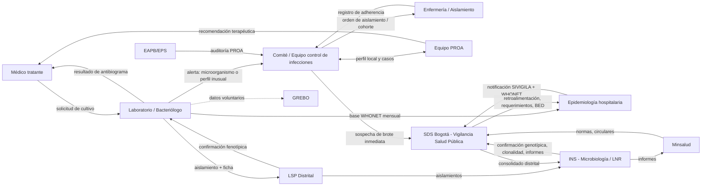
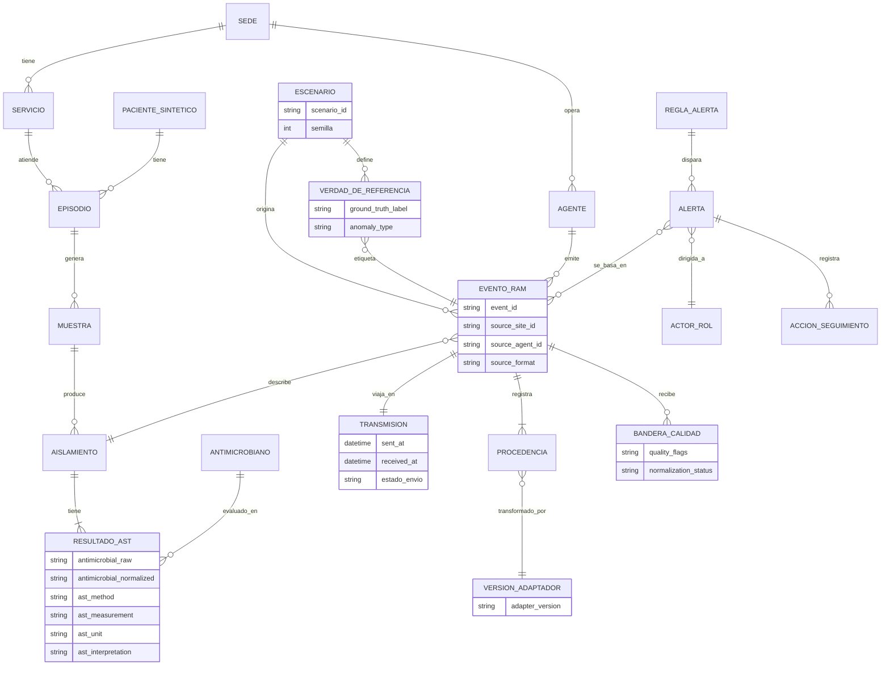

# Bloque D — Alcance, actores y preparación de la reunión con HUSI (30 sep 2026)

Versión 2, alineada con el Informe de avance de investigación y viabilidad técnica del 24 de septiembre de 2026.

Se propone iniciar el sistema con dos niveles: **hospital (sedes hipotéticas simuladas) y Bogotá (una SDS simulada que consolida)**. En ellos la norma colombiana ya define quién genera, quién valida y quién recibe la información de resistencia antimicrobiana (RAM), y es donde la plataforma puede aportar sin intervenir en la atención clínica.

## Resumen

- **Niveles.** En la vigilancia real de RAM, el laboratorio del hospital (UPGD) envía cada mes bases WHONET a la Secretaría Distrital de Salud (SDS), y esta las remite al INS. Los brotes y los perfiles nuevos de resistencia se notifican de inmediato por una vía aparte. El mínimo viable del proyecto abarca **hospital y Bogotá**, con tres alertas como núcleo: una epidemiológica, una de calidad de datos y una operacional. El paciente se maneja solo como entidad de datos sintéticos, la zona (localidad o subred) queda como extensión y Colombia queda fuera del alcance.
- **Actores y normas.** Las obligaciones clave provienen del Decreto 3518 de 2006 (SIVIGILA), la Circular 045 de 2012, la Resolución 2471 de 2022 (comités IAAS y PROA), la Circular 029 de 2021, los protocolos INS de brotes IAAS (2024) y de resistencia bacteriana (actualizado en 2026), los criterios INS de envío de aislamientos (2024) y, en Bogotá, la Resolución SDS 3107 de 2023 junto con los lineamientos distritales de carbapenemasas (2022).
- **Escenarios con base real.** El Boletín Epidemiológico Distrital 2019–2023 ofrece series publicadas y pruebas estadísticas que permiten construir escenarios anómalos y casos negativos que el equipo no diseñó por su cuenta. Esto reduce el riesgo de validación circular.
- **Reunión.** El propósito no es validar la idea, sino identificar qué le duele hoy a HUSI: la calidad de los datos antes del envío WHONET (según ConsultorSalud, los lineamientos nacionales 2026 del INS exigen concordancia total entre los casos de infecciones asociadas a dispositivos y procedimientos reportados en SIVIGILA y en WHONET), las alertas tempranas al comité de infecciones o la trazabilidad. El equipo debería llegar con las diez preguntas imprescindibles y con las cinco decisiones pendientes del informe.

---

## 1. Niveles de análisis

### 1.1 Funcionamiento actual (fuentes públicas)

- **Flujo SIVIGILA.** El Decreto 3518 de 2006 crea el SIVIGILA. Las Unidades Primarias Generadoras de Datos (UPGD, es decir, las IPS como HUSI) captan los datos y los transfieren a las Unidades Notificadoras (secretarías de salud). Estas configuran los casos y los envían al nivel nacional. La notificación es obligatoria según los protocolos y el incumplimiento acarrea sanciones.
- **IAAS y RAM dentro de SIVIGILA.** La Circular 045 de 2012 incorporó al SIVIGILA la vigilancia de IAAS, resistencia y consumo de antimicrobianos, con implementación obligatoria y gradual. También estableció que el INS es la única institución autorizada para recolectar esa información a nivel nacional.
- **Resistencia (vía WHONET, mensual).** El laboratorio de cada UPGD extrae los datos de su equipo automatizado, los convierte a WHONET con BacLink y los envía a la entidad territorial, que los consolida y remite al INS. La vigilancia cubre UCI y hospitalización, **no urgencias**, con puntos de corte CLSI y nueve microorganismos priorizados: *S. aureus*, *S. epidermidis* (este último solo en UCI neonatal y pediátrica, según el resumen de ConsultorSalud del protocolo 2026), *E. faecalis*, *E. faecium*, *E. coli*, *K. pneumoniae*, *E. cloacae*, *P. aeruginosa* y *A. baumannii*.
- **Brotes (vía inmediata).** Según el protocolo INS de brotes IAAS (v02, 31 jul 2024), se sospecha brote ante cualquiera de tres situaciones: aumento de casos sobre lo esperado, primer caso de un microorganismo nuevo de interés en la IPS, o cambio del perfil de resistencia. La sospecha se genera **aunque se trate de un único caso**. El primer SITREP se emite 24 horas después de la notificación.
- **Confirmación por laboratorio de referencia.** Los aislamientos viajan de la UPGD al Laboratorio de Salud Pública (LSP distrital) y de ahí al Grupo de Microbiología del INS, registrados en SIVILAB-LabMuestras (evento 313).
- **Bogotá.** La Resolución SDS 3107 de 2023 obliga a las IPS de mediana y alta complejidad a implementar los lineamientos distritales de carbapenemasas: tamizaje, aislamiento, cohortización y notificación de bases. Los PROA son obligatorios en esas IPS del Distrito desde 2017, según el Boletín Epidemiológico Distrital.

### 1.2 Tabla de niveles

En el modelo del proyecto, las **sedes hipotéticas** cumplen el papel de las UPGD y la **plataforma central** cumple el papel de la SDS que consolida. La columna "Quién la ve o recibe hoy" describe la realidad; la columna "¿Entra al alcance?" describe lo que el sistema simula.

| Nivel | Ejemplo de alerta o reporte (real o análogo) | Quién la ve o recibe hoy | ¿Entra al alcance? |
|---|---|---|---|
| **Paciente** | Aislamiento con carbapenemasa en un paciente, que activa la precaución de contacto | Servicio tratante y equipo de control de infecciones (el lineamiento SDS indica informar de inmediato) | **Parcial.** Solo como entidad sintética, sin alertas clínicas ni decisiones sobre el paciente |
| **Hospital (sede hipotética)** | Aumento sobre la línea base de una combinación microorganismo-antimicrobiano; base WHONET incompleta antes del envío; sede que deja de transmitir | Comité de infecciones/IAAS, equipo PROA, epidemiología hospitalaria, laboratorio | **Sí (núcleo del MVP)** |
| **Zona (localidad/subred)** | Agregación por localidad de residencia, al estilo de las tablas del BED | SDS y, en la red pública, las 4 Subredes Integradas (Acuerdo 641 de 2016) | **Extensión (fase 2)**, por validar |
| **Bogotá (SDS simulada)** | Consolidado mensual WHONET por sede; silencio epidemiológico de una sede (el protocolo INS 2018 lo define como la ausencia de notificación de la base WHONET dentro de los plazos establecidos); tendencia distrital de *K. pneumoniae* resistente a carbapenémicos | SDS (Subdirección de Vigilancia en Salud Pública, LSP distrital) | **Sí (núcleo del MVP)**, simulado |
| **Colombia** | Informe nacional WHONET; confirmación genotípica y clonalidad del INS; reporte a ReLAVRA/GLASS | INS, Minsalud, OPS | **No.** Solo como referencia para formatos y umbrales |

### 1.3 Nivel mínimo viable propuesto: hospital + Bogotá

1. **Es donde nace y se valida el dato.** La calidad de la base WHONET es responsabilidad de la UPGD, y la validación y consolidación, de la entidad territorial. Los agentes del proyecto simulan sedes y la plataforma central imita el papel consolidador de la SDS.
2. **Existen reglas públicas y concretas** que se pueden convertir en reglas de alerta: definiciones de sospecha de brote, perfiles de resistencia vigilados, plazos mensuales y silencio epidemiológico.
3. **Se evita el riesgo clínico.** El nivel paciente implica decisiones de aislamiento y tratamiento que corresponden al comité y al PROA.
4. **La zona agrega poco al inicio.** Las subredes son la red pública de prestación y HUSI es privado, de modo que la agregación territorial sirve más para el análisis que para la operación. *Supuesto por validar.*

### 1.4 Dimensionamiento de la simulación

El Boletín Epidemiológico Distrital (vol. 21, n.º 11, 2024) permite dimensionar los volúmenes reales de la vigilancia en Bogotá:

- Entre 2019 y 2023 se reportaron **94.436 aislamientos en UCI de adultos** (cerca de 19.000 por año en promedio) y 11.042 en UCI pediátricas.
- El laboratorio distrital recibió **6.148 aislamientos** de infecciones entre 2019 y 2023, y **2.475 aislamientos implicados en IAAS** entre 2022 y 2023.

Los volúmenes son moderados. Por inferencia, esto sugiere que la pregunta de escalabilidad del proyecto es de **concurrencia de ingesta** (número de agentes y tasa de emisión) y no de procesamiento de datos masivos. Es un argumento para discutir con el asesor la decisión de infraestructura.

---

## 2. Actores

### 2.1 Marco normativo que genera obligaciones

| Norma o documento | Qué obliga (resumen) | Plazo / periodicidad |
|---|---|---|
| Decreto 3518 de 2006 (compilado en Decreto 780 de 2016) | Crea el SIVIGILA; las UPGD captan y notifican a las Unidades Notificadoras; la notificación es obligatoria según los protocolos | Según cada protocolo |
| Circular 045 de 2012 (Minsalud) | Incorpora IAAS, resistencia y consumo al SIVIGILA; el INS es el único recolector nacional | Implementación gradual |
| Circular 029 de 2021 (Minsalud–INS) | Las IPS notifican a la secretaría las sospechas de brote de IAAS de forma inmediata y custodian los aislamientos; las secretarías monitorean cada mes con SIVIGILA y WHONET y activan Equipos de Respuesta Inmediata; las EPS verifican a su red | Inmediato (brote); mensual (monitoreo) |
| Resolución 2471 de 2022 (Minsalud) | Lineamientos IAAS y PROA, obligatorios para secretarías, prestadores, EPS e INS; crea comités IAAS y PROA nacional, territorial e institucional, con equipos operativos en cada IPS | Permanente |
| Protocolo INS Brotes de IAAS (v02, 2024) | Definiciones de sospecha de brote; matriz de caracterización; SITREP enviado a brotes.iaas@ins.gov.co | SITREP 1 a las 24 h de la notificación |
| Protocolo INS Resistencia bacteriana hospitalaria | Envío mensual de bases WHONET; variables mínimas; nueve microorganismos; los comités de infecciones analizan la información | 2018: UPGD días 1–5, distrito, INS día 20. 2026 (según ConsultorSalud): UPGD días 5–10, nivel departamental máximo día 20 cuando interviene una unidad municipal, INS máximo día 30; fuera de plazo es silencio epidemiológico |
| INS, Criterios de envío de aislamientos IAAS (nov 2024) | Ficha, antibiograma y SIVILAB (evento 313); los brotes van a clonalidad; las coproducciones de carbapenemasas se envían todas | Aislamientos con toma de hasta 2 meses |
| INS, Comunicado de resistencia a ceftazidima-avibactam | El laboratorio reporta de inmediato al equipo de vigilancia y control de infecciones; se caracteriza como brote por perfil nuevo; se notifica a la entidad territorial y luego al INS | Inmediato |
| INS, Lineamiento WHONET (ene 2024) | Las entidades territoriales publican un informe anual de análisis WHONET y lo envían al INS | Segunda semana de mayo |
| Resolución SDS 3107 de 2023 (Bogotá) | Obliga a EAPB e IPS a acciones ante carbapenémicos: lineamientos MPC, tamización, cohortización, Equipo Operativo Institucional y notificación de bases | Inmediata y obligatoria |
| SDS, Lineamientos distritales MPC (2022) | Definiciones MRC/MPC; criterios de tamizaje; aislamiento preventivo; manejo de contactos y del egreso | Aislamiento durante toda la hospitalización, como mínimo |

### 2.2 Ficha por actor

| Actor | Qué hace | Qué produce | Qué necesita |
|---|---|---|---|
| **Bacteriólogo / laboratorio clínico (HUSI)** | Identifica el microorganismo, realiza el antibiograma (CMI/disco, CLSI) y los tamizajes fenotípicos (APB, EDTA, mCIM) o moleculares | Informe de identificación y antibiograma; base WHONET mensual; aislamientos remitidos al LSP; alertas al comité | Datos demográficos y de servicio completos; reglas de alerta; retroalimentación del LSP/INS |
| **Médico tratante** | Decide el tratamiento | Solicitud de cultivos; datos clínicos (infección frente a colonización) | Resultado oportuno y recomendaciones del PROA. *Fuera del alcance del sistema* |
| **Epidemiólogo hospitalario** | Vigila las IAAS, construye canales endémicos y notifica en SIVIGILA | Notificaciones SIVIGILA, matriz de brote, SITREP | Series históricas por servicio y microorganismo (el INS pide comparar con los últimos cinco años) |
| **Comité / equipo de control de infecciones (IAAS)** | Define la estrategia, clasifica casos, investiga brotes y decide medidas | Actas, planes de acción, órdenes de aislamiento y cohorte | Alertas del laboratorio, tableros y trazabilidad del caso |
| **Equipo PROA** (infectólogo, químico farmacéutico, bacteriólogo, enfermería, epidemiólogo) | Optimiza el uso de antimicrobianos (Res. 2471/2022, tercer nivel) | Guías empíricas, antibiograma acumulado, indicadores | Perfil local de resistencia y consumo (DDD) |
| **Enfermería / servicio de aislamiento** | Aplica precauciones de contacto, tamizaje (hisopado rectal) y cohorte | Registro de aislamientos y adherencia | Orden oportuna y claridad sobre el estado del paciente (sospechoso, colonizado, infectado) |
| **HUSI (institución, UPGD)** | Responde legalmente por la notificación | Notificación oficial a la SDS | Cumplimiento normativo y soporte |
| **SDS Bogotá – Vigilancia en Salud Pública** | Unidad notificadora distrital: valida y consolida WHONET/SIVIGILA, lidera el programa IAAS/PROA distrital y el BED | Consolidados, BED, requerimientos por silencio epidemiológico, asistencia técnica | Bases completas y a tiempo; notificación inmediata de brotes |
| **LSP distrital (SDS)** | Confirma mecanismos fenotípicamente y remite al INS | Resultados confirmatorios | Aislamientos con ficha completa |
| **Subredes Integradas (Norte, Sur, Sur Occidente, Centro Oriente)** | Red pública de prestación desde 2016 | Datos como UPGD públicas | Lo mismo que cualquier UPGD. *Su papel en la vigilancia territorial está por validar* |
| **INS** (Vigilancia; Grupo de Microbiología–LNR) | Define protocolos, consolida la información nacional, confirma genotipo y clonalidad | Informes nacionales WHONET, comunicados técnicos, resultados de referencia | Consolidados distritales y aislamientos |
| **Minsalud** | Rectoría: circulares, Res. 2471, Plan Nacional RAM, Comité Nacional IAAS-RAM | Normas | Indicadores nacionales |
| **EAPB/EPS** | Verifican la red y auditan los PROA (Res. SDS 3107) | Auditorías; condiciones en acuerdos de voluntades | Información de colonizados en referencia y contrarreferencia (*por validar*) |
| **GREBO** | Red académica de hospitales de tercer nivel de Bogotá, fundada en 2001 (según grupogrebo.org; su Boletín 10 reporta para 2017 nueve instituciones de Bogotá y seis de fuera), que publica perfiles de resistencia con WHONET; exige comité de infecciones y laboratorio con control de calidad. Su Boletín 13 consolida 21 instituciones y sirve para perfilar sedes con datos más granulares | Boletines de resistencia | Bases de los hospitales participantes |
| **Laboratorio externo (tercerizado)** | Procesa muestras por contrato | Resultados | El INS rechaza fichas que ponen el laboratorio tercerizado en lugar de la IPS, por lo que la trazabilidad es crítica |

**Dato útil para la reunión.** La versión 2017 de los lineamientos distritales de carbapenemasas tuvo coautores de HUSI: una enfermera (Claudia Linares), una infectóloga (Sandra Gualtero) y bacteriólogas (Gloria Cortés, Beatriz Ariza, Diana Mendoza). Es probable que HUSI ya aplique ese lineamiento, pero conviene preguntarlo en la reunión y no darlo por hecho.

---

## 3. Mapa de actores y borrador de entidades

> **Borrador basado en información pública. Debe validarse con HUSI.** No representa flujos internos reales de HUSI.

### 3.1 Flujo de actores

### 3.2 Entidades y relaciones (borrador para el modelo canónico)

El diagrama incorpora las entidades que sustentan el aporte experimental del proyecto (escenario, verdad de referencia, transmisión, calidad y versión del adaptador) y usa los nombres del diccionario de datos v0.1 del informe.

**Notas**

- `RESULTADO_AST` debe guardar el valor crudo (CMI o halo), el estándar (CLSI y su versión) y la interpretación S/I/R. El INS adopta el CLSI M100 vigente.
- `PROCEDENCIA` registra sede de origen, agente, versión de esquema, marcas de tiempo, transformaciones y validaciones aplicadas, de modo que toda alerta se pueda rastrear hasta evento, sede, adaptador y escenario.
- `VERDAD_DE_REFERENCIA` solo la consulta el evaluador al final; el generador y el motor de detección no comparten esa etiqueta (principio 3 y 4 del informe).
- `TRANSMISION` corresponde al grupo "Transmisión" del diccionario y permite inyectar y medir retrasos, pérdidas y duplicados.
- `ACTOR_ROL` debe representar un rol (comité, PROA, SDS simulada) y no una persona.
- Quedan fuera del núcleo la localidad, las pruebas de mecanismo de resistencia (APB, EDTA, mCIM, PCR, variable GEN_CARB) y los reportes periódicos consolidados, que se tratan como vistas derivadas o extensiones.

---

## 4. Qué entra y qué queda fuera

### 4.1 Entra (núcleo del MVP)

| Ítem | Justificación | ¿Validar con HUSI? |
|---|---|---|
| Agentes que simulan sedes (dos como mínimo, con estructuras de entrada realmente diferentes) y generan eventos sintéticos con campos tipo WHONET | Es el formato real de la vigilancia de RAM en Colombia | Sí: campos y codificación |
| Configuración de escenarios versionada y reproducible (sedes, volumen, formatos, tasas sintéticas, anomalías y semilla) | Permite repetir experimentos con distintas semillas y volúmenes | No |
| Inyección de fallos de transmisión y calidad: retrasos, pérdidas, duplicados, campos faltantes e inválidos | Es el eje diferenciador frente a WHONET, BacLink y AMASS | No |
| Dos adaptadores de entrada, validación y estandarización a modelo canónico con CLSI | El INS exige CLSI; cubre las alertas de calidad de datos | Sí: versión CLSI y paneles |
| Procedencia y trazabilidad por evento hasta el dato original | El INS rechaza fichas incoherentes o con el laboratorio tercerizado mal registrado | No |
| **Una alerta epidemiológica:** aumento sobre la línea base de una combinación microorganismo-antimicrobiano por sede y periodo | Regla pública y medible con verdad de referencia | **Sí: umbral y destinatario** |
| **Una alerta de calidad de datos:** campo requerido faltante o inválido | Criterio de rechazo real del INS | Sí |
| **Una alerta operacional:** sede sin envío (silencio epidemiológico) o retraso frente al plazo | Análogo al silencio epidemiológico | Sí: plazos |
| Dashboard sencillo orientado a demostrar trazabilidad y resultado experimental | Nivel mínimo viable; no compite con una plataforma clínica | Sí |
| **Arnés de pruebas con evaluador experimental** que compara resultados contra la verdad de referencia y genera las métricas de prioridad alta | Es lo que convierte el prototipo en aporte investigativo | No |

### 4.2 Fase 2 / extensiones (solo si el núcleo se estabiliza)

| Ítem | Justificación | ¿Validar con HUSI? |
|---|---|---|
| Reglas candidatas adicionales: primer aislamiento o perfil nuevo en la sede, fenotipos priorizados, sospecha de coproducción de carbapenemasas | Reglas públicas del INS, pero amplían el catálogo | Sí: umbrales y destinatarios |
| Alertas de calidad adicionales: "SIN DATO", servicio de urgencias incluido por error, fecha de toma mayor a 2 meses, S/I/R incoherente con la CMI | Criterios de rechazo reales del INS | Sí |
| **Alerta de caso o aislamiento individual** | Exige validación experta y WHONET ya la cubre. Se incorpora solo si HUSI la solicita | **Sí: decisión pendiente** |
| Agregación por localidad | Útil para análisis tipo BED | **Sí: determinar si resulta útil** |
| Tercer agente de sede | Solo si aporta una variación significativa y no compromete el calendario | No |
| Métricas de prioridad media: throughput, recuperación tras interrupción, escalabilidad (2, 3, N agentes) | Se ejecutan si el desarrollo alcanza estabilidad | No |

### 4.3 Queda fuera

| Ítem | Justificación |
|---|---|
| Datos reales de pacientes | Alcance del proyecto; evita el régimen de datos sensibles |
| Diagnóstico clínico (infección frente a colonización) | Lo clasifica el equipo de control de infecciones |
| Prescripción o recomendación terapéutica | Es función del PROA y del médico tratante |
| Órdenes reales de aislamiento | Las decide el comité; el sistema solo simula el evento "orden emitida" |
| Notificación oficial a SIVIGILA, SIVILAB o WHONET | La vigilancia real es una obligación legal de la UPGD y la SDS |
| Confirmación genotípica y clonalidad | Es competencia del LSP y del INS |
| Integración con el LIS/HIS real de HUSI | *Propuesta por validar como fase futura, solo con datos anonimizados* |
| Atribuir al prototipo la epidemiología real de un hospital específico | Sin datos autorizados, los escenarios solo representan situaciones plausibles basadas en fuentes externas |
| Nivel nacional | Fuera del MVP |

---

## 5. Escenarios con base real (anti-circularidad)

El principal riesgo metodológico del proyecto es que el equipo genere las anomalías y luego mida cuántas detecta su propio detector. Para reducirlo, se propone construir parte de los escenarios a partir de series y pruebas estadísticas **publicadas** en el Boletín Epidemiológico Distrital 2019–2023 (BED), cuyos datos provienen del reporte distrital WHONET. La etiqueta de verdad de referencia de esos escenarios se define con la prueba estadística del propio boletín, y no con las reglas del detector.

Estos datos se usan como parámetros de plausibilidad para eventos sintéticos. No describen a HUSI ni a ninguna institución específica.

| Escenario | Dato publicado | Uso en el sistema | Tipo |
|---|---|---|---|
| **Aumento abrupto significativo** | *K. pneumoniae* frente a meropenem en UCI de adultos: 36,6 % (n = 3.871) en 2022 a 47,8 % (n = 4.388) en 2023; cambio significativo (p ajustado ≈ 1e-23). Frente a imipenem, 39,5 % a 50,6 % | Anomalía epidemiológica con verdad de referencia positiva | Positivo |
| **Variación no significativa** | Mismo par, 2021 a 2022: 34,9 % (n = 9.048) a 36,6 % (n = 3.871); p ajustado = 0,133 (no significativo) | El sistema no debe alertar | Negativo / caso límite |
| **Comportamiento estable** | *E. coli* frente a carbapenémicos en UCI de adultos: entre 1,2 % y 3,2 % durante 2019–2023 | Serie estable que no debe disparar alertas | Negativo |
| **Perfil de mecanismos nuevo** | Coproducción KPC-NDM-SHV en 40 % (116 aislamientos) y KPC-NDM en 18,6 % (54 aislamientos) de los aislamientos de *K. pneumoniae* recibidos por el laboratorio distrital en 2023, frente a valores marginales en años previos | Escenario de perfil nuevo | Positivo (fase 2, ligado a la alerta individual) |
| **Cobertura desigual de tamizaje entre sedes** | De 20 IPS evaluadas por la SDS, 17 reportaron; el 58,1 % realizaba tamización de colonizados y la positividad de MPC fue 12,87 % | Perfiles de sedes con prácticas y completitud distintas | Heterogeneidad |
| **Líneas base distintas según la fuente** | Según lo recogido en el resumen del proyecto (Boletín 13 de GREBO, 21 instituciones), *K. pneumoniae* en UCI de adultos en 2023 tuvo 827 aislamientos y resistencia de 37,8 % a imipenem y 36,6 % a meropenem, frente a 50,6 % y 47,8 % en la serie distrital para el mismo año y servicio | Perfiles de sedes con líneas base diferentes | Heterogeneidad |

**Requisitos para usar estos escenarios**

1. Documentar fuente, tabla, año y prueba estadística de cada escenario.
2. Congelar el catálogo de escenarios antes de implementar las reglas del detector y versionarlo.
3. Que una persona distinta a quien escribe el detector escriba el generador.
4. Incluir los casos negativos y límite en la misma proporción que los positivos.
5. Verificar en el boletín original de GREBO las cifras de la última fila antes de usarlas.

---

## 6. Preguntas para la reunión del 30 con HUSI

Las preguntas marcadas con (★) son imprescindibles y conviene abordarlas primero.

### (a) Qué necesita realmente el cliente

1. (★) ¿Qué problema concreto de hoy debería ayudar a entender o probar esta idea: calidad de datos, alertas tempranas, trazabilidad o formación?
2. (★) ¿Quién usaría el resultado en HUSI: laboratorio, comité de infecciones, PROA o epidemiología?
3. (★) ¿Qué tipo de alerta resultaría más útil ver simulada: epidemiológica, de calidad de datos u operacional?
4. ¿Resulta útil una vista de "Bogotá simulada" o basta con el nivel hospital?
5. ¿Cómo se mediría que el prototipo funcionó?

### (b) Qué NO necesita o ya tiene resuelto

6. (★) ¿Qué alertas ya generan hoy WHONET, el sistema del equipo automatizado o el LIS, y que no convenga duplicar? WHONET incluye alertas como "especie importante", "resistencia importante", "enviar a laboratorio de referencia" y "alertar a control de infecciones".
7. ¿Existen ya tableros o canales endémicos? ¿En qué herramienta?
8. ¿Hay algo que el sistema definitivamente no deba tocar?

### (c) Cómo funciona hoy en HUSI

9. (★) Cuando aparece un aislamiento importante (por ejemplo, una carbapenemasa), ¿cuál es el recorrido paso a paso y en cuánto tiempo: laboratorio, quién, quién?
10. (★) ¿Quién decide un aislamiento de contacto, con qué criterio y cuándo se levanta? El lineamiento distrital no define criterios para levantarlo.
11. (★) ¿Es posible obtener un formato anonimizado de antibiograma y de informe del bacteriólogo, con los campos reales?
12. (★) ¿Qué reglas de alerta se usan hoy, con qué umbrales y ventanas, y quién recibe cada una?
13. (★) ¿Quién arma y envía la base WHONET mensual a la SDS, y cuáles son los errores o devoluciones más frecuentes?
14. ¿Qué tamizajes se hacen al ingreso (UCI, remitidos, neonatos) y cómo se registra el resultado?
15. ¿Se usa laboratorio externo para alguna prueba? ¿Cómo se conserva la trazabilidad?
16. ¿Cómo y cuándo se notifica a la SDS una sospecha de brote? ¿Quién la firma?
17. ¿Qué retroalimentación se recibe de la SDS, el LSP o el INS, y cuánto tarda?
18. ¿HUSI sigue participando en GREBO?

### (d) Validación de supuestos (encontrados en la investigación)

19. (★) ¿HUSI aplica los lineamientos distritales de carbapenemasas (Res. SDS 3107/2023) tal como están escritos, o con adaptaciones internas?
20. ¿Ya se trabaja con los plazos del protocolo INS actualizado en 2026 (bases entre los días 5 y 10), o todavía con los de la versión anterior (días 1 a 5)?
21. ¿Es correcto modelar la subred o la localidad como un nivel, o para un hospital privado como HUSI el flujo es directo HUSI a SDS?
22. ¿Se excluyen las urgencias de la base WHONET, como indica el protocolo?
23. ¿Los resultados moleculares (PCR o paneles) pasan por el comité antes de notificarse, como pide el protocolo 2026?
24. ¿Qué versión de CLSI se usa? ¿Se emplea EUCAST en algún caso?

### (e) Decisiones pendientes del informe (a cerrar con HUSI)

25. ¿HUSI desea una alerta de caso o aislamiento individual? Si es así, ¿con qué reglas, qué prioridades y quién las validaría?
26. ¿Cuál es el retraso máximo aceptable entre un hallazgo en el laboratorio y la alerta correspondiente?
27. ¿Qué sistema de información de laboratorio (LIS) o equipo automatizado se usa, y qué formato de exportación genera? Esto define los adaptadores de entrada.
28. ¿Sería posible aportar datos históricos anonimizados, solo para validar el adaptador de entrada y sin alterar el carácter sintético del resto de los datos? ¿Bajo qué condiciones de autorización?
29. ¿Quién, dentro de HUSI o de su red de contactos, podría validar el pequeño conjunto de reglas microbiológicas del sistema?

---

## Salvedades

- **Fuente secundaria para 2026.** Los plazos y cambios del protocolo INS de resistencia bacteriana de 2026 (bases entre los días 5 y 10, envío al INS el día 30, variable GEN_CARB, nuevos antibióticos en los perfiles) provienen de un resumen de ConsultorSalud (25 sep 2026). El PDF original no pudo abrirse. La versión 2018 (fuente primaria) indica días 1 a 5 y día 20. Se debe confirmar con el PDF del INS antes de fijar reglas.
- **Sin plazo en horas.** El protocolo de resistencia 2018 indica notificación inmediata de brotes, sin un plazo en horas. El plazo de 24 horas corresponde al SITREP del protocolo de brotes 2024 y a protocolos anteriores para que la entidad territorial avise al INS.
- **Contenido no documentado.** No existe información pública sobre los formatos internos de HUSI, sus reglas de alerta ni quién recibe cada alerta. Todo ello se trata como pregunta y no como supuesto.
- **Cifras del BED.** Los valores de la sección 5 provienen de las tablas 1, 2 y 4 del boletín. La introducción del mismo boletín cita cifras distintas para *K. pneumoniae* en UCI de adultos entre 2021 y 2022 (32,4 % a 35,1 %), tomadas de un boletín anterior; no coinciden con las tablas y por eso no se usan. Las cifras de 36,6 % y 47,8 % corresponden a meropenem, no a carbapenémicos en general.
- **Cifras de GREBO.** Los datos del Boletín 13 de GREBO se toman del resumen del proyecto y no se verificaron en el boletín original.
- **Cifras nacionales de contexto (no para reglas).** Según ConsultorSalud (25 sep 2026), con datos nacionales WHONET 2025, la resistencia a carbapenémicos de *K. pneumoniae* fue de 25,1 % en UCI de adultos, 19,3 % en UCI pediátricas y 6,3 % en UCI neonatales.

---

## Referencias

1. Decreto 3518 de 2006 (SIVIGILA). https://www.ins.gov.co/Normatividad/Decretos/DECRETO%203518%20DE%202006.pdf
2. Ministerio de Salud y Protección Social, Circular 045 de 2012. https://jurinfo.jep.gov.co/normograma/compilacion/docs/circular_minsaludps_0045_2012.htm
3. Ministerio de Salud y Protección Social e INS, Circular 029 de 2021. https://normograma.supersalud.gov.co/compilacion/docs/circular_minsaludps_0029_2021.htm
4. Ministerio de Salud y Protección Social, Resolución 2471 de 2022. https://www.minsalud.gov.co/Normatividad_Nuevo/Resoluci%C3%B3n%20No.%202471%20de%202022.pdf
5. INS, Protocolo de vigilancia en salud pública: brotes de infecciones asociadas a la atención en salud (v02, 2024). https://www.ins.gov.co/buscador-eventos/Lineamientos/Pro_IAAS%202024.pdf
6. INS, Protocolo de vigilancia en salud pública: resistencia bacteriana a los antimicrobianos en el ámbito hospitalario. https://www.ins.gov.co/BibliotecaDigital/PRO-Resistencia-bacteriana.pdf
7. INS, Criterios para el envío de aislamientos bacterianos y levaduras recuperados en IAAS (2024). https://www.ins.gov.co/BibliotecaDigital/criterios-para-el-envio-de-aislamientos-bacterianos-y-levaduras-genero-candida-spp-recuperados-en-iaas-para-confirmacion-de-mecanismos-de-resistencia-2024.pdf
8. INS, Comunicado técnico: vigilancia intensificada por laboratorio de resistencia a ceftazidima-avibactam. https://www.ins.gov.co/BibliotecaDigital/comunicado-tecnico-vigilancia-intensificada-por-laboratorio-de-resistencia-a-ceftazidimaavibactam-mediada-por-betalactamasas-en-enterobacterales-en-colombia.pdf
9. INS, Lineamiento técnico de resistencia antimicrobiana a través de la herramienta WHONET (2024). https://www.ins.gov.co/BibliotecaDigital/lineamiento-tecnico-resistencia-antimicrobiana-a-traves-de-la-herramienta-whonet.pdf
10. INS, Vigilancia por WHONET de resistencia antimicrobiana en el ámbito hospitalario. Colombia, 2022 a 2024. https://www.ins.gov.co/BibliotecaDigital/vigilancia-por-whonet-resistencia-antimicrobiana-en-ambito-hospitalario-colombia-2022-a-2024.pdf
11. Secretaría Distrital de Salud de Bogotá, Resolución 3107 de 2023. https://www.alcaldiabogota.gov.co/sisjur/normas/Norma1.jsp?i=152877&dt=S
12. Secretaría Distrital de Salud de Bogotá, Lineamientos distritales de vigilancia de carbapenemasas. https://www.saludcapital.gov.co/DSP/Resistencia%20Bacteriana/VIGILANCIA%20MPC/Lineamientos_distrital_Vig_Carb.pdf
13. Concejo de Bogotá, Acuerdo 641 de 2016. https://www.alcaldiabogota.gov.co/sisjur/normas/Norma1.jsp?i=65686
14. Sastoque Díaz, L. A., Correal Tovar, P. C., y Hernández González, Y. R. (2024). Caracterización de la resistencia antimicrobiana en el ámbito hospitalario y aportes de las acciones PROA y CAB, Bogotá 2019 a 2023. Boletín Epidemiológico Distrital, 21(11), 5-20. https://revistas.saludcapital.gov.co/index.php/BED/article/download/600/680/1732
15. Grupo para el Control de la Resistencia Bacteriana de Bogotá (GREBO), Boletín informativo No. 13 (2024). https://www.grupogrebo.org/wp-content/uploads/2024/05/GREBO-Boletin-13.pdf
16. ConsultorSalud, "Resistencia bacteriana Colombia: INS revela cifras de 2025". https://consultorsalud.com/resistencia-bacteriana-colombia-ins-uci-2025/
17. WHONET, Getting started (tutorial). https://whonet.org/WebDocs/WHONET%201.Getting%20started.html
18. Equipo RAM (2026). Informe de avance de investigación y viabilidad técnica del proyecto RAM. Pontificia Universidad Javeriana.
