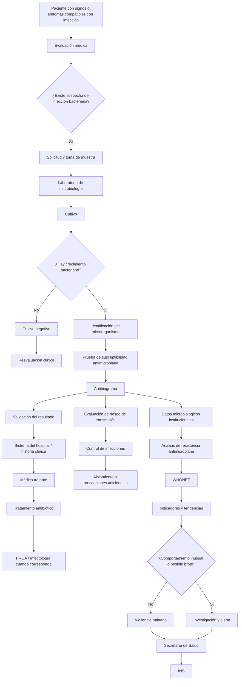
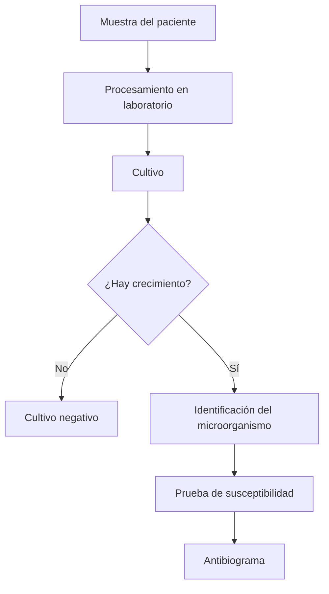
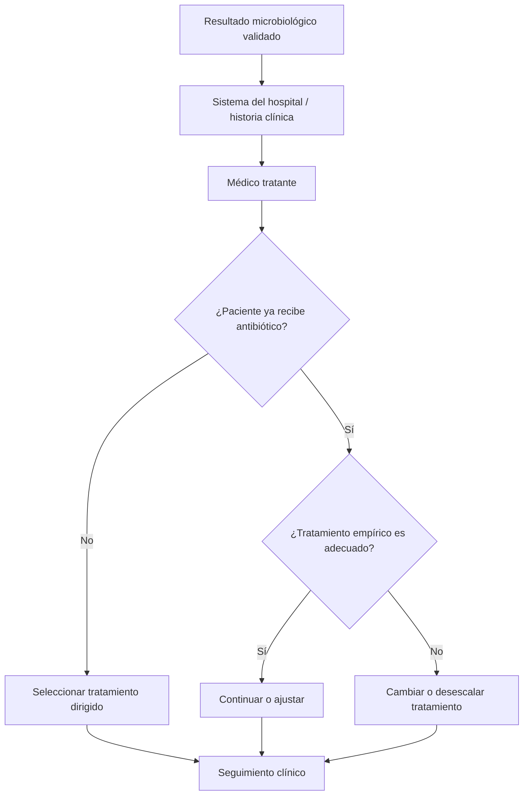
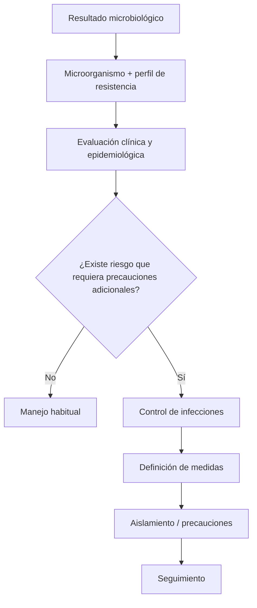
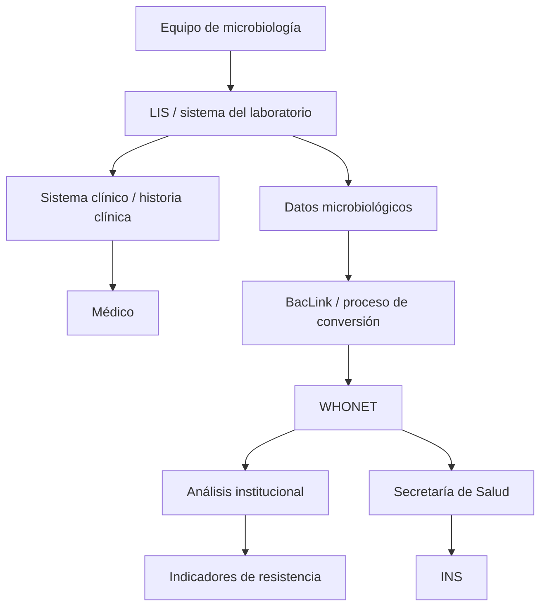
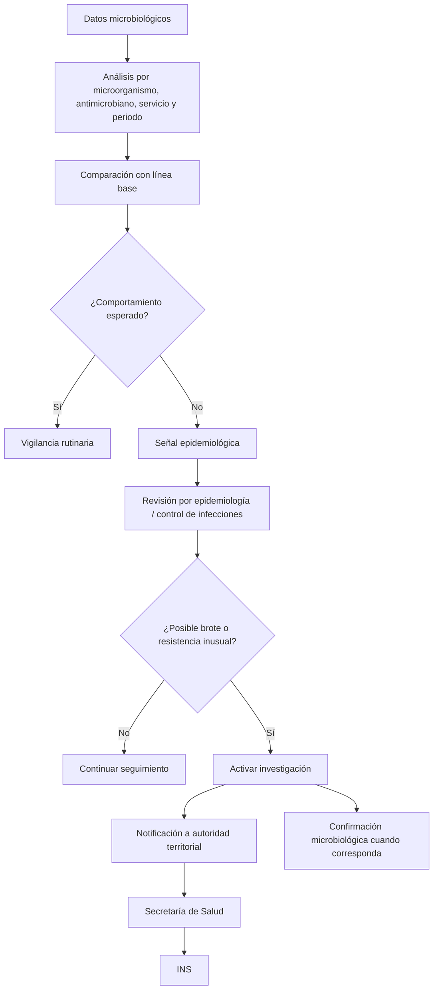
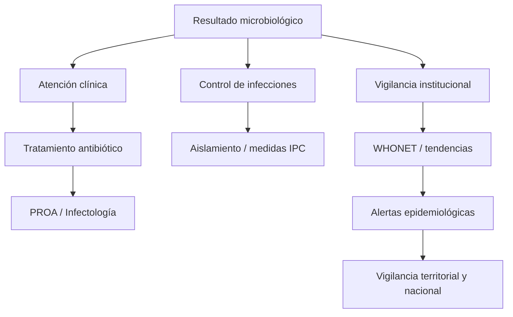
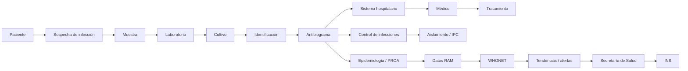

# Flujo actual de atención, laboratorio, control de infecciones y vigilancia de resistencia antimicrobiana

## 1. Propósito

Este documento organiza el flujo que necesitamos comprender para el proyecto, desde la sospecha de una infección bacteriana hasta el uso del resultado microbiológico en:

1. la atención del paciente;
2. la selección o ajuste del tratamiento antibiótico;
3. las medidas de aislamiento y control de infecciones;
4. el análisis institucional de resistencia antimicrobiana;
5. la vigilancia mediante WHONET;
6. y el escalamiento de eventos inusuales o posibles brotes.

El punto central es que **un mismo resultado microbiológico puede alimentar varios procesos al mismo tiempo**. Por eso no conviene representar todo como una única línea.

---

# 2. Flujo general

El flujo completo puede resumirse así:



Este flujo se divide mejor en cinco procesos.

---

# 3. Flujo 1 — Atención clínica y diagnóstico microbiológico

## 3.1. Sospecha de infección

El proceso comienza cuando el paciente presenta signos o síntomas compatibles con infección.

Pueden aparecer signos locales como:

- edema;
- eritema;
- supuración;
- dolor;
- cambios en el sitio afectado.

También pueden aparecer signos sistémicos como:

- fiebre;
- taquicardia;
- hipotensión;
- deterioro general.

Estos hallazgos generan una sospecha clínica, pero todavía no identifican el microorganismo ni permiten saber qué antibiótico sería efectivo.

El médico evalúa al paciente y decide si se requiere una muestra microbiológica.

---

## 3.2. Solicitud de muestra

La muestra depende del foco sospechado.

| Situación | Ejemplo de muestra |
|---|---|
| Sospecha de bacteriemia | Hemocultivos |
| Infección de herida o secreción | Cultivo de secreción |
| Infección urinaria | Urocultivo |
| Infección respiratoria | Muestra respiratoria |
| Otros focos | Muestra correspondiente al sitio |

Cuando la condición clínica lo permite, la muestra debe obtenerse antes de iniciar antibióticos.

En pacientes graves puede iniciarse tratamiento empírico antes de conocer el resultado definitivo, sin esperar el antibiograma si retrasar el tratamiento representa un riesgo.

---

## 3.3. Cultivo

La muestra llega al laboratorio de microbiología.

El laboratorio procesa la muestra con el objetivo de establecer si existe crecimiento bacteriano.



### Cultivo negativo

Cuando no se recupera un microorganismo, normalmente no existe un aislamiento sobre el cual realizar un antibiograma convencional.

Un cultivo negativo no significa por sí solo que la infección esté completamente descartada. El médico debe interpretarlo junto con:

- signos y síntomas;
- tratamiento antibiótico previo;
- calidad de la muestra;
- evolución clínica;
- otras pruebas diagnósticas.

---

## 3.4. Cultivo positivo

Si hay crecimiento, el laboratorio identifica el microorganismo.

Ejemplo:

```text
Cultivo positivo
        ↓
Identificación
        ↓
Klebsiella pneumoniae
```

Después se realiza la prueba de susceptibilidad antimicrobiana cuando corresponde.

---

## 3.5. Antibiograma

El antibiograma permite establecer la respuesta del microorganismo frente a diferentes antimicrobianos.

Ejemplo:

| Antimicrobiano | Interpretación |
|---|---|
| Ceftriaxona | R |
| Cefepime | R |
| Meropenem | S |
| Amikacina | S |

Además de la interpretación S/I/R, el laboratorio puede manejar información como:

- MIC o CIM;
- diámetro del halo;
- método utilizado;
- microorganismo identificado;
- tipo de muestra;
- servicio;
- fecha;
- observaciones del laboratorio.

El antibiograma se interpreta utilizando criterios estandarizados de susceptibilidad antimicrobiana.

---

# 4. Flujo 2 — Resultado microbiológico y tratamiento del paciente

Una vez validado, el resultado queda disponible en el sistema institucional.

El flujo clínico es:



Pueden presentarse dos situaciones principales.

### Paciente sin tratamiento antibiótico

El médico utiliza el cultivo, la identificación del microorganismo y el antibiograma para seleccionar un tratamiento dirigido.

### Paciente con tratamiento empírico

El paciente puede haber iniciado antibióticos antes de disponer del resultado.

Cuando llega el antibiograma se compara el tratamiento actual con la susceptibilidad observada.

Puede decidirse:

- mantener el antibiótico;
- modificarlo;
- cambiar a otro antimicrobiano;
- ajustar la dosis;
- desescalar a una opción de menor espectro.

En determinados casos pueden intervenir infectología o el PROA para apoyar la optimización del tratamiento.

---

# 5. Flujo 3 — Aislamiento y control de infecciones

Un cultivo positivo o una bacteria resistente no significan automáticamente que el paciente deba ser aislado.

La decisión depende del microorganismo, el perfil de resistencia, la vía de transmisión y el contexto clínico y epidemiológico.



Las medidas pueden incluir, según el caso:

- precauciones estándar;
- precauciones de contacto;
- precauciones por gotas;
- precauciones aéreas;
- cohorte;
- habitación individual;
- uso de elementos de protección personal;
- medidas reforzadas de higiene de manos.

Para el flujo institucional todavía es necesario establecer exactamente:

- quién toma la decisión;
- quién registra la medida;
- cómo aparece en el sistema;
- qué microorganismos o perfiles la activan;
- quién verifica que la medida se esté cumpliendo.

---

# 6. Flujo 4 — Vigilancia rutinaria de resistencia antimicrobiana

El resultado microbiológico también puede utilizarse para analizar el comportamiento de la resistencia en una población.

Aquí deja de analizarse únicamente el paciente individual y se comienzan a agregar múltiples aislamientos.

Ejemplo:

```text
Paciente 1 → K. pneumoniae → Meropenem R
Paciente 2 → K. pneumoniae → Meropenem S
Paciente 3 → K. pneumoniae → Meropenem R
Paciente 4 → K. pneumoniae → Meropenem R
```

A partir de estos resultados se calcula la proporción de resistencia:

\[
\text{Resistencia (\%)} =
\frac{\text{aislamientos resistentes}}
{\text{aislamientos evaluados}}
\times 100
\]

Por ejemplo:

```text
K. pneumoniae + Meropenem

Enero      28 % R
Febrero    31 % R
Marzo      33 % R
Abril      39 % R
Mayo       45 % R
```

Esto permite analizar:

- microorganismo;
- antimicrobiano;
- servicio;
- hospital;
- periodo;
- tipo de muestra;
- proporción de resistencia;
- evolución temporal.

La interpretación correcta es:

> aumenta la proporción de aislamientos resistentes a un determinado antimicrobiano en una población o periodo.

No debe interpretarse como que “los pacientes se vuelven resistentes”.

---

## 6.1. Flujo hacia WHONET

WHONET no necesariamente es el sistema clínico donde el médico consulta al paciente.

El hospital puede utilizar internamente un LIS, HIS, historia clínica electrónica, software de equipos microbiológicos y otras herramientas.

Después, los datos microbiológicos relevantes pueden convertirse y analizarse mediante WHONET.



WHONET puede utilizarse para:

- porcentaje de aislamientos resistentes;
- porcentaje susceptibles;
- perfiles de resistencia;
- tendencias en el tiempo;
- análisis por microorganismo;
- análisis por antimicrobiano;
- análisis por servicio;
- identificación de patrones inusuales.

---

## 6.2. Duplicados de un mismo paciente

Para el análisis epidemiológico no conviene contar repetidamente el mismo microorganismo resistente del mismo paciente como si cada aislamiento representara un caso independiente.

Ejemplo:

```text
Paciente 001

Día 1  → K. pneumoniae resistente
Día 4  → K. pneumoniae resistente
Día 8  → K. pneumoniae resistente
```

Para determinados análisis de susceptibilidad se emplean reglas de deduplicación, como utilizar el primer aislamiento del paciente dentro de un periodo establecido.

Esto evita inflar artificialmente las proporciones de resistencia.

---

# 7. Flujo 5 — Resistencia inusual, alerta epidemiológica y posible brote

La vigilancia rutinaria no significa que cada aislamiento resistente produzca inmediatamente una alerta nacional.

La situación cambia cuando aparece:

- un perfil de resistencia inusual;
- un microorganismo no esperado;
- un aumento significativo frente al comportamiento histórico;
- varios casos relacionados;
- un posible brote.



Este flujo es especialmente importante para el proyecto porque permite distinguir entre:

### Resultado resistente individual

```text
Paciente
   ↓
K. pneumoniae
   ↓
Meropenem R
```

Puede requerir actuación clínica, pero no necesariamente constituye una alerta epidemiológica.

### Perfil de resistencia inusual

```text
Microorganismo
       +
Perfil de resistencia inesperado
       ↓
Revisión epidemiológica
       ↓
Alerta
```

### Incremento de resistencia

```text
30 % → 31 % → 34 % → 42 % → 49 %
                          ↓
              desviación frente a línea base
                          ↓
                 alerta de tendencia
```

---

# 8. Relación entre los cinco flujos

Los cinco procesos parten de los mismos datos, pero tienen objetivos diferentes.



### Ruta clínica

Busca responder:

> ¿Qué tratamiento necesita este paciente?

### Ruta de control de infecciones

Busca responder:

> ¿Se requieren medidas adicionales para evitar transmisión dentro del hospital?

### Ruta de vigilancia RAM

Busca responder:

> ¿Cómo se está comportando la resistencia en el hospital y está ocurriendo algo fuera de lo esperado?

---

# 9. Actores involucrados

| Actor | Función dentro del flujo |
|---|---|
| Paciente | Presenta signos/síntomas y aporta la muestra |
| Médico tratante | Evalúa, ordena estudios, interpreta resultados y define tratamiento |
| Personal asistencial | Participa en toma, manejo y transporte de muestras según el procedimiento |
| Bacteriólogo / laboratorio | Procesa la muestra, identifica el microorganismo y realiza/valida susceptibilidad |
| LIS / HIS | Conserva y distribuye la información clínica |
| Infectología | Apoya decisiones clínicas complejas |
| PROA | Optimiza el uso de antimicrobianos |
| Control de infecciones | Define y supervisa medidas de prevención y aislamiento |
| Epidemiología hospitalaria | Analiza eventos, tendencias y señales epidemiológicas |
| WHONET | Permite estandarizar y analizar datos de resistencia |
| Secretaría de Salud | Recibe y consolida información territorial |
| INS | Consolida y analiza la vigilancia nacional |

---

# 10. Información que necesita manejar el sistema de simulación

El flujo anterior permite identificar un conjunto inicial de datos que los agentes hospitalarios deberían poder representar.

## Paciente y contexto

- identificador sintético;
- edad;
- sexo, cuando aplique al análisis;
- servicio;
- hospital/sede;
- fecha de ingreso;
- ubicación.

## Muestra

- identificador;
- tipo de muestra;
- fecha y hora;
- sitio de obtención;
- estado de la muestra.

## Microbiología

- microorganismo;
- fecha de identificación;
- método de identificación;
- resultado del cultivo.

## Susceptibilidad antimicrobiana

- antimicrobiano;
- MIC/CIM o valor disponible;
- interpretación S/I/R;
- método de susceptibilidad;
- mecanismo de resistencia cuando exista.

## Trazabilidad

- sede que originó el dato;
- sistema/formato de origen;
- fecha de recepción;
- fecha de procesamiento;
- validaciones;
- transformaciones realizadas.

## Alertas

- tipo;
- fecha;
- regla que la produjo;
- microorganismo;
- antimicrobiano;
- servicio;
- prioridad;
- estado;
- destinatario.

---

# 11. Aspectos que deben aclararse específicamente con HUSI

Para transformar estos flujos en el proceso institucional real todavía deben obtenerse respuestas concretas sobre:

1. qué sistema utiliza el laboratorio;
2. qué sistema utiliza el médico para consultar resultados;
3. cómo se integran laboratorio e historia clínica;
4. si existen resultados preliminares y definitivos;
5. quién valida el resultado microbiológico;
6. qué resultados generan una notificación inmediata;
7. cómo recibe esa notificación el médico;
8. quién activa aislamiento;
9. qué reglas internas determinan aislamiento;
10. cuándo interviene infectología;
11. cuándo interviene PROA;
12. cuándo interviene control de infecciones;
13. cómo se extraen los datos para WHONET;
14. quién realiza la conversión mediante BacLink o el mecanismo utilizado;
15. si WHONET se usa únicamente para vigilancia externa o también para análisis interno;
16. cómo se identifica internamente una resistencia inusual;
17. cómo se investiga un posible brote;
18. quién notifica a la Secretaría Distrital de Salud;
19. qué documentos o archivos se envían;
20. cómo se hace seguimiento al cierre de una alerta.

---

# 12. Diagrama final resumido del sistema real que necesitamos estudiar



La arquitectura conceptual que interesa al proyecto está justamente en el punto donde diferentes hospitales pueden producir información microbiológica con formatos y sistemas distintos, pero esos datos deben convertirse en eventos comparables para poder analizarlos, mantener su procedencia y generar indicadores y alertas.

Por eso, el estudio del flujo real debe centrarse en cinco preguntas:

1. **¿Cómo nace el dato?**
2. **¿Qué datos se generan?**
3. **¿Quién los recibe y utiliza?**
4. **¿Cómo pasan de un sistema o actor a otro?**
5. **¿Qué condición convierte un resultado rutinario en una alerta?**
